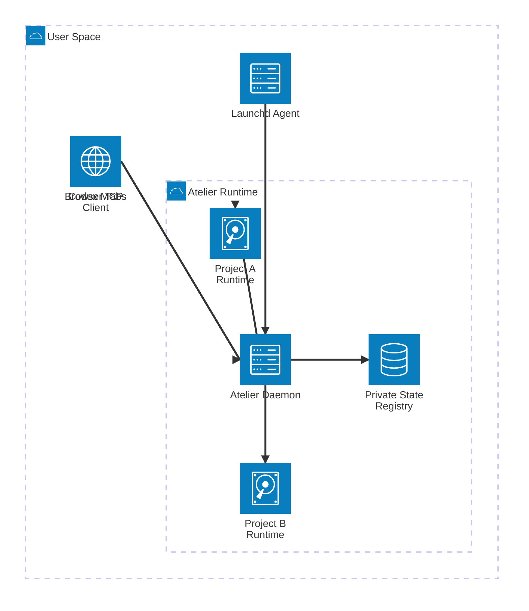
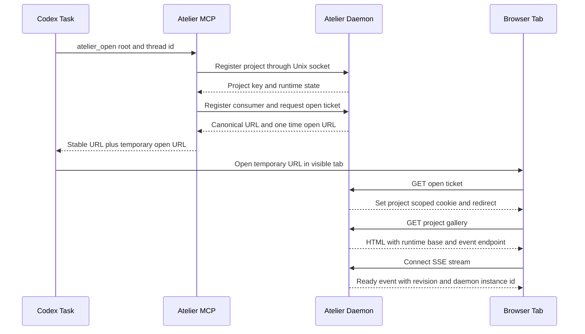
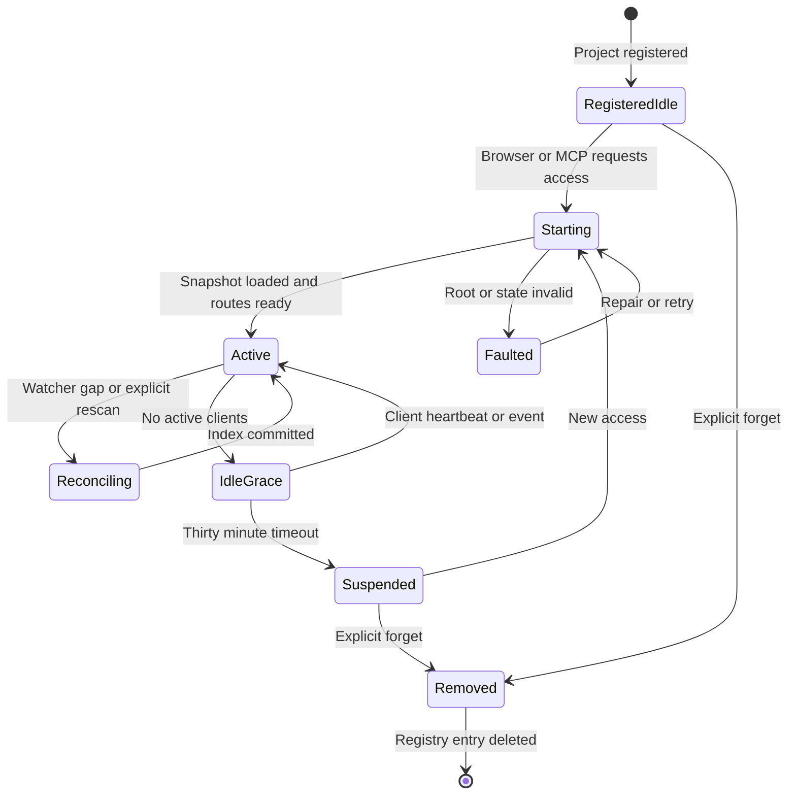

# Plan détaillé — daemon Atelier Rust persistant, multi-projets et intégré à Codex

Ce document est le contrat d’implémentation à remettre à Grok. Il décrit comment remplacer le modèle actuel « un `atelier-server` enfant par projet, possédé par `atelier-mcp` » par un daemon Rust unique, persistant sous macOS, capable de servir plusieurs projets et plusieurs tâches Codex sans ports morts, sans mélange d’annotations et sans dépendance Python.

Le résultat attendu n’est pas seulement un serveur qui démarre. Il doit être installable, observable, sécurisé, rétrocompatible pendant la migration, mesurable et vérifiable dans un checkout propre ainsi que dans l’interface réellement servie à Codex.

> [!IMPORTANT]
> Grok doit exécuter les phases dans l’ordre, produire un commit cohérent par phase et arrêter immédiatement une phase si son critère de sortie n’est pas satisfait. Il ne doit ni pousser la branche, ni supprimer les fichiers non suivis de l’utilisateur, ni déclarer un succès à partir des seuls fichiers source.

## 📋 Sommaire

- [Décision](#-décision)
- [État actuel vérifié](#-état-actuel-vérifié)
- [Objectifs et limites](#-objectifs-et-limites)
- [Architecture cible](#-architecture-cible)
- [Identité et isolation des projets](#-identité-et-isolation-des-projets)
- [Routage HTTP et sessions](#-routage-http-et-sessions)
- [Cycle de vie](#-cycle-de-vie)
- [Contrats de données](#-contrats-de-données)
- [API du daemon](#-api-du-daemon)
- [Indexation, surveillance et événements](#-indexation-surveillance-et-événements)
- [Sécurité](#-sécurité)
- [Commandes et installation](#-commandes-et-installation)
- [Découpage du code](#-découpage-du-code)
- [Phases d’implémentation](#-phases-dimplémentation)
- [Tests et seuils d’acceptation](#-tests-et-seuils-dacceptation)
- [Migration et retour arrière](#-migration-et-retour-arrière)
- [Observabilité et diagnostic](#-observabilité-et-diagnostic)
- [Protocole de vérification Codex](#-protocole-de-vérification-codex)
- [Livrables exigés de Grok](#-livrables-exigés-de-grok)
- [Prompt à remettre à Grok](#-prompt-à-remettre-à-grok)

## 🎯 Décision

La cible est un seul processus utilisateur `atelier-daemon`, lancé par `launchd`, avec les propriétés suivantes.

| Propriété | Décision obligatoire |
| --- | --- |
| Processus | Un seul processus Rust `atelier-daemon` pour tous les projets de l’utilisateur |
| Port navigateur | `127.0.0.1:9359`, fixe et configurable |
| Contrôle local | Socket Unix privé, distinct du port navigateur |
| Projet | Racine canonique transformée en clé stable SHA-256 |
| URL | `http://127.0.0.1:9359/p/{project_key}/...` |
| Tâche Codex | Consommateur distinct identifié par `CODEX_THREAD_ID` |
| Frontend | Une même surface IDE, peu importe si le fichier vient de la galerie ou de l’explorateur |
| Événements | SSE par projet, relayé entre onglets avec `BroadcastChannel` |
| Index | Chargement du dernier instantané immédiatement, réconciliation en arrière-plan |
| Surveillance | Un watcher actif par projet utilisé, suspendu après inactivité |
| Annotations | Banque persistante par projet; livraison explicitement adressée à une tâche |
| Sécurité | Boucle locale uniquement, socket et état privés, ticket navigateur à usage unique |
| Compatibilité | Ancien serveur par projet conservé derrière un drapeau pendant une version |
| Runtime | Rust uniquement en production; Node demeure uniquement un outil de build/test frontend |

Le daemon ne doit pas être un simple superviseur qui démarre plusieurs `atelier-server`. Une telle solution stabiliserait partiellement le cycle de vie, mais conserverait plusieurs processus, plusieurs ports et le même problème de divergence. La cible finale contient un registre de projets et plusieurs runtimes de projet dans un même processus Axum/Tokio.

## 🔎 État actuel vérifié

La base actuelle fonctionne, mais son modèle de propriété n’est pas compatible avec une durée de vie indépendante de Codex.

| Élément actuel | Emplacement | Comportement observé | Changement requis |
| --- | --- | --- | --- |
| Serveur HTTP | [`rust/crates/atelier-server/src/main.rs`](../rust/crates/atelier-server/src/main.rs) | Un `AppState` contient une seule `root`, un port et un watcher | Extraire une application réutilisable et déplacer la racine dans un `ProjectRuntime` |
| MCP Codex | [`rust/crates/atelier-mcp/src/main.rs`](../rust/crates/atelier-mcp/src/main.rs) | `ensure_server()` construit puis engendre `atelier-server`; le processus MCP en conserve la propriété | Remplacer le spawn par un client du daemon sur socket Unix |
| CLI | [`rust/crates/atelier-cli/src/main.rs`](../rust/crates/atelier-cli/src/main.rs) | `serve`, `run`, `open`, `doctor` raisonnent en serveur et port de projet | Ajouter les commandes `daemon` et faire de `open` un client du daemon |
| Routes | [`rust/crates/atelier-server/src/main.rs`](../rust/crates/atelier-server/src/main.rs) | Toutes les routes sont globales, par exemple `/code`, `/compile`, `/agent-status` | Les monter sous `/p/{project_key}/api/v1` |
| Assets | [`assets/`](../assets/) | Plusieurs appels utilisent encore des chemins absolus à l’origine | Centraliser toute construction d’URL dans un runtime frontend |
| Annotations | [`rust/crates/atelier-server/src/agent.rs`](../rust/crates/atelier-server/src/agent.rs) | Les fichiers sont déjà isolés par une clé SHA-256 de la racine | Réutiliser ce principe et unifier la fonction de clé dans `atelier-core` |
| Watcher | [`rust/crates/atelier-server/src/main.rs`](../rust/crates/atelier-server/src/main.rs) | Un événement pertinent déclenche un rebuild global après temporisation | Introduire une mise à jour incrémentale et un rescan complet de secours |
| Générateur | [`rust/crates/atelier-core/src/gallery_builder.rs`](../rust/crates/atelier-core/src/gallery_builder.rs) | `WalkDir` parcourt le projet et réécrit les instantanés | Séparer scan initial, index en mémoire et sérialisation atomique |
| Installation | [`install.sh`](../install.sh), [`scripts/install-release.sh`](../scripts/install-release.sh) | Copie trois binaires et les assets; aucun LaunchAgent | Installer le quatrième binaire et gérer le plist de façon idempotente |
| Release | [`scripts/build-release.sh`](../scripts/build-release.sh) | Construit `atelier-server`, `atelier-cli` et `atelier-mcp` | Ajouter `atelier-daemon`, son plist modèle et les contrôles de release |
| Plugin | [`plugins/atelier/.mcp.json`](../plugins/atelier/.mcp.json) | Exécute `atelier-mcp` en stdio | Conserver le protocole MCP, mais le rendre client du daemon |
| Tests | [`tests/`](../tests/), [`rust/crates/atelier-server/tests/http_smoke.rs`](../rust/crates/atelier-server/tests/http_smoke.rs) | Bons tests mono-projet et surfaces éditeur | Ajouter isolation multi-projets, relance launchd et injection de pannes |

### Problème précis à supprimer

Aujourd’hui, une tâche Codex charge le plugin, le plugin démarre son processus MCP, puis le MCP peut posséder un serveur enfant. Quand le processus parent vieillit, est rechargé ou utilise encore une ancienne version installée, l’onglet conserve une URL qui ne correspond plus nécessairement au runtime vivant. Le port stable par projet réduit les variations, mais ne rend pas le serveur indépendant de la tâche Codex.

La nouvelle architecture doit garantir ces invariants:

1. arrêter ou recharger Codex ne tue pas Atelier;
2. deux tâches du même projet reçoivent exactement la même URL de projet;
3. deux projets différents utilisent le même port sans partager leurs fichiers, événements, préférences ou annotations;
4. un onglet ancien peut détecter un redémarrage du daemon et se reconnecter;
5. une mise à jour du binaire installé est visible dans `/version`, avec PID, version et hash de build;
6. aucun processus Python n’est lancé.

## 🧭 Objectifs et limites

### Objectifs fonctionnels

- Ouvrir Atelier dans Codex en moins d’une seconde lorsqu’un instantané existe déjà.
- Conserver les annotations non envoyées quand une tâche ou Codex redémarre.
- Permettre plusieurs onglets Atelier et plusieurs tâches Codex sur le même projet.
- Permettre plusieurs projets simultanés sur le même daemon.
- Garder l’IDE, les thèmes, les actions d’annotation, LaTeX, PDF, Markdown et le code identiques entre galerie et explorateur.
- Conserver la compilation LaTeX, SyncTeX, le split PDF, les notes, le board, Git, Zotero et les opérations de fichiers.
- Exposer un diagnostic compréhensible: version servie, binaire, PID, uptime, projets, watchers, clients et dernières erreurs.
- Permettre installation, mise à jour, redémarrage et désinstallation sans intervention manuelle dans le plist.

### Objectifs non fonctionnels

- Une seule écoute TCP sur la boucle locale.
- Aucun polling rapide par iframe lorsque SSE est connecté.
- Aucun scan complet synchrone sur le chemin d’ouverture chaud.
- Écritures atomiques pour le registre, l’index, les préférences et les annotations.
- Limites de concurrence globales et par projet pour Chrome, miniatures et LaTeX.
- Compatibilité avec un checkout propre et une installation release sans Cargo.

### Hors périmètre

- Accès réseau distant, partage LAN ou exposition Internet.
- Synchronisation cloud des annotations.
- Authentification multi-utilisateurs.
- Réécriture de CodeMirror 6 en Rust ou WebAssembly.
- Refonte visuelle de l’IDE pendant cette migration.
- Suppression immédiate de `atelier-server`; il sert de fallback pendant la période de transition.
- Base SQLite obligatoire. Un registre JSON atomique suffit tant que les tests de concurrence passent.

## 🏗️ Architecture cible

_Architecture locale montrant Codex et le navigateur reliés à un daemon Rust unique, lequel maintient des runtimes isolés pour plusieurs projets et persiste son registre, ses événements et ses journaux dans le dossier utilisateur_:



### Composants

| Composant | Responsabilité | Ne doit pas faire |
| --- | --- | --- |
| `launchd` | Démarrer le daemon à l’ouverture de session et le relancer après crash | Connaître les projets ou les tâches Codex |
| `atelier-daemon` | Écouter sur `9359`, gérer le registre, les sessions, les runtimes et les quotas | Posséder l’état spécifique d’un seul projet |
| `ProjectRegistry` | Résoudre `project_key → canonical_root`, charger et suspendre les runtimes | Lire des chemins sans canonicalisation |
| `ProjectRuntime` | Index, watcher, annotations, Git, LaTeX, notes, board et cache d’un projet | Accéder à une autre racine |
| `atelier-mcp` | Traduire les outils Codex en commandes de contrôle du daemon | Engendrer ou tuer le serveur HTTP normal |
| `atelier-cli` | Installer, diagnostiquer et appeler le daemon | Dupliquer la logique de registre |
| Runtime frontend | Préfixer les URLs, gérer la session et recevoir SSE | Déduire le projet depuis l’onglet actif globalement |

### Structure des processus

```text
launchd
└── atelier-daemon --port 9359 --control-socket <private socket>
    ├── Axum listener 127.0.0.1:9359
    ├── Unix control listener
    ├── ProjectRegistry
    │   ├── ProjectRuntime A
    │   │   ├── watcher
    │   │   ├── incremental index
    │   │   └── event broadcaster
    │   └── ProjectRuntime B
    ├── global Chrome semaphore
    ├── global thumbnail semaphore
    └── global LaTeX semaphore

Codex task 1 ── atelier-mcp ── Unix socket ──┐
Codex task 2 ── atelier-mcp ── Unix socket ──┼── same daemon
CLI user ───────────────────── Unix socket ──┘
```

## 🆔 Identité et isolation des projets

### Clé stable

Créer une seule fonction publique dans `atelier-core`:

```rust
pub fn project_key(root: &Path) -> Result<String, CoreError>
```

Algorithme obligatoire:

1. canonicaliser la racine;
2. sur macOS, conserver la forme canonique fournie par le système sans normalisation textuelle destructive;
3. encoder le chemin en UTF-8 lossy uniquement pour le hash, jamais pour rouvrir le projet;
4. SHA-256 du chemin canonique;
5. conserver les 24 premiers caractères hexadécimaux;
6. tester espaces, accents, symlink, racine supprimée et deux chemins pointant au même inode.

Cette fonction remplace les copies existantes dans `atelier-mcp` et `atelier-server/src/agent.rs`. Une clé n’accorde aucun droit; elle ne sert qu’à l’identité et au routage.

### Registre persistant

Chemin recommandé:

```text
~/Library/Application Support/Atelier/daemon/
├── registry.json
├── sessions.json
├── daemon.json
├── daemon.sock
├── daemon.token
├── logs/
│   ├── bootstrap.log
│   ├── events.jsonl
│   └── events.1.jsonl
└── projects/
    └── <project_key>/
        ├── runtime.json
        └── errors.jsonl
```

Permissions:

| Élément | Mode |
| --- | --- |
| Répertoire `daemon/` | `0700` |
| Socket Unix | `0600` |
| Jeton de contrôle | `0600` |
| JSON et journaux | `0600` |
| Plist utilisateur | `0644` |

Schéma minimal de `registry.json`:

```json
{
  "schemaVersion": 1,
  "projects": {
    "93d2d746e45091146c34dc75": {
      "canonicalRoot": "/Users/example/Documents/project-a",
      "displayName": "project-a",
      "registeredAt": 1783810000,
      "lastOpenedAt": 1783810400,
      "lastActivityAt": 1783810450,
      "pinned": false
    }
  }
}
```

Règles:

- écriture par fichier temporaire, `fsync`, renommage atomique et permissions contrôlées;
- conserver une copie `.bak` de la dernière version valide;
- si le JSON est invalide, le déplacer vers `registry.corrupt-<timestamp>.json`, charger `.bak` et journaliser une erreur visible;
- vérifier que la racine existe au moment d’activer un runtime, pas au démarrage du daemon;
- ne jamais suivre automatiquement une racine déplacée vers un chemin différent;
- retirer un projet du registre seulement par commande explicite ou après une politique de nettoyage documentée.

`sessions.json` suit les mêmes garanties atomiques. Il ne conserve que le hash de l’identifiant opaque, la clé du projet, le consommateur Codex par défaut, les permissions, la date de création et l’expiration. Cette persistance permet aux onglets déjà ouverts de se reconnecter après le redémarrage du daemon sans placer une capacité durable dans leur URL. Les sessions expirées sont purgées au démarrage puis périodiquement.

### Isolation en mémoire

Le daemon contient:

```rust
struct DaemonState {
    config: Arc<DaemonConfig>,
    registry: Arc<ProjectRegistry>,
    sessions: Arc<SessionStore>,
    global_limits: Arc<GlobalLimits>,
    started_at: Instant,
    build: BuildInfo,
}

struct ProjectRuntime {
    key: ProjectKey,
    root: PathBuf,
    lifecycle: RwLock<ProjectLifecycle>,
    revision: AtomicU64,
    index: RwLock<ArtifactIndex>,
    watcher: Mutex<Option<ProjectWatcher>>,
    agent: Mutex<AgentStore>,
    events: broadcast::Sender<ProjectEvent>,
    rebuild_lock: Mutex<()>,
    latex_limit: Semaphore,
    activity: ProjectActivity,
}
```

Chaque handler reçoit `ProjectContext` après résolution du préfixe. Aucun module de fichiers, Git, documents, Zotero, notes ou annotations ne doit lire une racine globale.

## 🌐 Routage HTTP et sessions

### Espaces de routes

| Préfixe | Usage | Authentification |
| --- | --- | --- |
| `/healthz` | Liveness minimale du daemon | Aucune, boucle locale seulement |
| `/version` | Version, PID, build hash, protocole | Aucune donnée sensible |
| `/open/{ticket}` | Consommer un ticket unique et créer une session | Ticket à usage unique, expiration 30 s |
| `/assets/{build_hash}/...` | Assets frontend immuables partagés | Session non requise, CSP stricte |
| `/p/{project_key}/...` | Pages et fichiers du projet | Cookie de session limité au projet |
| `/p/{project_key}/api/v1/...` | API du projet | Cookie de session + origine locale |
| Socket Unix | Enregistrement, tickets, diagnostic, arrêt | Permission du socket + jeton de contrôle |

### URL canonique d’un projet

```text
http://127.0.0.1:9359/p/<project_key>/figures_index.html?nativeFs=1&theme=Codex
```

L’URL doit rester identique après:

- fermeture et réouverture de Codex;
- redémarrage du daemon;
- ouverture depuis une autre tâche du même projet;
- mise à jour des assets;
- suspension puis réactivation du runtime.

### Ouverture depuis Codex



### Ticket et cookie

Le socket de contrôle retourne un ticket aléatoire de 256 bits et deux URLs distinctes:

```json
{
  "url": "http://127.0.0.1:9359/p/<project_key>/figures_index.html?nativeFs=1&theme=Codex",
  "openUrl": "http://127.0.0.1:9359/open/<one_time_ticket>"
}
```

`url` est canonique et identique pour toutes les tâches du même projet. `openUrl` est unique et doit être ouvert seulement pour établir la session; après redirection, l’onglet affiche `url`. Le skill Atelier doit ouvrir `openUrl`, puis vérifier que l’URL finale correspond à `url`.

Le daemon conserve seulement le hash du ticket avec:

- `project_key`;
- `consumer_id`;
- expiration de 30 secondes;
- compteur d’utilisation égal à un;
- paramètres d’ouverture autorisés.

Après consommation, le daemon crée un identifiant de session aléatoire, enregistre seulement son hash dans `sessions.json` et répond:

```http
Set-Cookie: atelier_session=<opaque>; Path=/p/<project_key>/; HttpOnly; SameSite=Strict; Max-Age=2592000
Location: /p/<project_key>/figures_index.html?nativeFs=1&theme=Codex
```

Le cookie ne contient ni chemin local, ni token maître, ni `CODEX_THREAD_ID` en clair. Une session peut survivre au restart du daemon, mais elle demeure révocable et expire au plus tard après 30 jours. Si le cookie est absent ou révoqué, la page montre une erreur locale explicite invitant à rouvrir Atelier depuis le plugin; elle ne crée jamais une session implicite.

### Runtime frontend unique

Ajouter un nouveau module partagé `assets/atelier_runtime.js`, chargé par toutes les surfaces.

Pour chaque réponse HTML de projet, le daemon injecte avant les scripts un bootstrap JSON non exécutable:

```html
<script type="application/json" id="atelier-bootstrap">
{"projectKey":"<key>","basePath":"/p/<key>","apiBase":"/p/<key>/api/v1","assetBase":"/assets/<hash>","daemonInstance":"<id>"}
</script>
```

Ce bootstrap ne contient aucun ticket, cookie, token ou chemin absolu local. `atelier_runtime.js` refuse les mutations si le bootstrap manque ou si sa clé ne correspond pas au préfixe courant. L’adaptateur legacy fournit le même contrat avec `basePath` vide, ce qui évite deux implémentations frontend pendant la transition.

Contrat minimal:

```javascript
window.AtelierRuntime = {
  projectKey,
  basePath,
  api(path),
  asset(path),
  openEditor(relativePath, surface),
  eventsUrl(),
  relativePath(value)
};
```

Migration obligatoire:

1. inventorier avec `rg` tous les `fetch('/...')`, `src="/..."`, `href="/..."`, `new EventSource('/...')` et URLs construites à la main;
2. remplacer les endpoints projet par `AtelierRuntime.api()`;
3. garder les assets partagés sous `AtelierRuntime.asset()`;
4. utiliser seulement des chemins relatifs projet dans les nouveaux onglets;
5. accepter temporairement un chemin absolu uniquement s’il canonicalise sous la racine du projet;
6. ajouter un test de contrat qui échoue si un nouvel endpoint projet absolu est introduit.

La galerie et l’explorateur doivent appeler exactement `openEditor()`. Il ne doit plus exister deux chemins de génération d’URL d’éditeur.

## 🔄 Cycle de vie



### Règles de cycle de vie

| Événement | Action |
| --- | --- |
| Enregistrement d’une racine | Écrire le registre, sans scanner immédiatement |
| Premier accès | Charger l’index existant, ouvrir l’AgentStore, démarrer le watcher, lancer la réconciliation |
| Onglet SSE actif | Mettre à jour `lastActivityAt` par heartbeat serveur |
| Appel MCP | Réactiver le runtime si nécessaire et renouveler le consommateur |
| Aucun client ni travail pendant 5 min | Passer en `IdleGrace`, conserver le watcher |
| Aucun client ni travail pendant 30 min | Arrêter le watcher, libérer les caches lourds, passer en `Suspended` |
| Projet épinglé | Ne pas suspendre automatiquement |
| Fichier de racine supprimé | Passer en `Faulted`, ne jamais servir un autre chemin |
| Crash du daemon | `launchd` redémarre; les runtimes sont recréés paresseusement |

Le daemon demeure vivant même lorsque tous les projets sont suspendus. Un runtime suspendu doit conserver seulement ses métadonnées légères dans le registre et ses fichiers persistants sur disque.

## 🧾 Contrats de données

### Informations de build

```rust
struct BuildInfo {
    version: String,
    git_sha: String,
    build_timestamp: String,
    target: String,
    protocol_version: u32,
    asset_hash: String,
}
```

Le build script injecte ces valeurs. `/version` ne doit jamais répondre uniquement `0.1.0` sans distinguer deux binaires différents.

### Runtime de projet public

```json
{
  "key": "93d2d746e45091146c34dc75",
  "displayName": "cmux-gallery",
  "state": "active",
  "revision": 184,
  "watcher": {
    "running": true,
    "lastEventAt": 1783810450,
    "lastError": null
  },
  "clients": {
    "browserSessions": 2,
    "codexConsumers": 3
  },
  "jobs": {
    "reconcile": false,
    "latex": 0,
    "thumbnail": 0
  }
}
```

Ne jamais exposer `canonicalRoot` dans une réponse destinée à une page non authentifiée. Une session de projet peut recevoir la racine seulement si l’interface en a réellement besoin.

### Événements SSE

```json
{
  "id": "01J...",
  "projectKey": "93d2d746e45091146c34dc75",
  "daemonInstance": "01J...",
  "revision": 185,
  "type": "annotation.changed",
  "timestamp": 1783810451,
  "payload": {
    "pending": 2
  }
}
```

Types initiaux:

| Type | Déclencheur |
| --- | --- |
| `daemon.ready` | Connexion ou reconnexion SSE |
| `project.state` | Activation, suspension, faute ou reprise |
| `gallery.revision` | Index visible modifié |
| `artifact.changed` | Artefact ajouté, modifié ou supprimé |
| `annotation.changed` | Banque ou historique modifié |
| `consumer.changed` | Tâche enregistrée, expirée ou renommée |
| `compile.started` | Compilation LaTeX acceptée |
| `compile.finished` | Compilation réussie ou échouée |
| `watcher.error` | Erreur du watcher |
| `runtime.error` | Erreur non fatale visible à l’utilisateur |

Le champ `revision` est monotone par projet. `daemonInstance` change après un redémarrage et permet à un onglet de forcer une resynchronisation complète.

## 🔌 API du daemon

### Contrôle sur socket Unix

Utiliser un protocole JSON Lines versionné. Chaque requête contient `id`, `protocol`, `method` et `params`; chaque réponse contient le même `id`, `ok`, `result` ou `error`.

Méthodes minimales:

| Méthode | Paramètres | Résultat |
| --- | --- | --- |
| `daemon.health` | aucun | PID, uptime, version, port, état du registre |
| `daemon.shutdown` | raison | arrêt contrôlé après vidage des écritures |
| `project.register` | racine | clé, nom, état |
| `project.open` | clé, consommateur, options | ticket à usage unique et URL |
| `project.status` | clé | état public détaillé |
| `project.list` | filtres | projets enregistrés |
| `project.rescan` | clé | job et nouvelle révision |
| `project.suspend` | clé | confirmation |
| `project.forget` | clé | confirmation, sans supprimer les fichiers du projet |
| `consumer.register` | clé, thread, label, mode | consommateur public |
| `consumer.heartbeat` | clé, consommateur | expiration renouvelée |
| `annotation.list` | clé, consommateur | éléments autorisés |
| `annotation.ack` | clé, consommateur, IDs | IDs confirmés |

Le MCP doit utiliser le socket. Les méthodes de contrôle ne doivent pas être accessibles sur le port HTTP normal.

### API HTTP de projet

Conserver les capacités existantes, mais les regrouper sous:

```text
/p/{project_key}/api/v1/
```

Mapping de transition:

| Route actuelle | Route cible |
| --- | --- |
| `/ping` | `/healthz` pour le daemon; `/p/{key}/api/v1/status` pour le projet |
| `/health` | `/p/{key}/api/v1/health` |
| `/rev` | `/p/{key}/api/v1/revision` |
| `/code` | `/p/{key}/api/v1/files/code` |
| `/codesave` | `/p/{key}/api/v1/files/save` |
| `/compile` | `/p/{key}/api/v1/documents/compile` |
| `/synctex` | `/p/{key}/api/v1/documents/synctex` |
| `/pdfannot` | `/p/{key}/api/v1/documents/pdf-annotations` |
| `/agent-status` | `/p/{key}/api/v1/agent/status` |
| `/agent-selections` | `/p/{key}/api/v1/agent/selections` |
| `/rescan` | `/p/{key}/api/v1/gallery/rescan` |
| `/state` | `/p/{key}/api/v1/gallery/state` |
| `/notes/*` | `/p/{key}/api/v1/notes/*` |
| `/board/*` | `/p/{key}/api/v1/board/*` |

Pendant une version, les anciennes routes peuvent être montées seulement dans le binaire legacy `atelier-server`. Le daemon ne doit pas exposer une ancienne route globale ambiguë.

### Codes d’erreur

| Code | Signification | HTTP |
| --- | --- | --- |
| `PROJECT_NOT_FOUND` | Clé inconnue | `404` |
| `PROJECT_ROOT_MISSING` | Racine enregistrée absente | `409` |
| `PROJECT_SUSPENDED` | Réactivation nécessaire | `503`, avec retry court |
| `SESSION_INVALID` | Cookie absent ou expiré | `401` |
| `ORIGIN_REJECTED` | Origine non locale | `403` |
| `PATH_OUTSIDE_ROOT` | Traversée ou symlink hors racine | `404` |
| `JOB_BUSY` | Limite de concurrence atteinte | `429` |
| `REGISTRY_CORRUPT` | État persistant invalide | `503` |
| `VERSION_MISMATCH` | Protocole client/daemon incompatible | `426` |

Toutes les erreurs API doivent être JSON structurées avec `code`, `message`, `requestId` et, si sûr, `details`.

## 👁️ Indexation, surveillance et événements

### Ouverture chaude

Ordre obligatoire:

1. valider la session et la clé;
2. charger `figures_data.json` et `figures_index.html` existants s’ils sont valides;
3. servir immédiatement la page existante;
4. démarrer le watcher;
5. comparer l’instantané disque à l’index en arrière-plan;
6. appliquer les deltas;
7. sérialiser atomiquement;
8. envoyer `gallery.revision`.

L’ouverture ne doit pas attendre un `WalkDir` complet si un instantané valide existe.

### Index incrémental

Créer un `ArtifactIndex` en mémoire indexé par chemin relatif:

```rust
struct ArtifactRecord {
    relative_path: String,
    kind: ArtifactKind,
    modified_ns: u128,
    size: u64,
    content_hash: Option<String>,
    thumbnail: Option<ThumbnailState>,
    metadata: ArtifactMetadata,
}
```

Pour un événement watcher:

- créer/modifier: recalculer seulement ce chemin;
- supprimer: retirer seulement ce chemin et ses caches;
- renommer: traiter ancien + nouveau;
- débordement ou erreur watcher: planifier une réconciliation complète;
- rafale: regrouper pendant 150 à 300 ms;
- écrire l’index au maximum une fois par seconde pendant une rafale;
- ne pas reconstruire si la représentation visible n’a pas changé.

Le scan complet reste disponible pour `project.rescan`, démarrage sans index, corruption et reprise après événement perdu.

### Exclusions

Revoir `EXCLUDED_DIRECTORIES` dans [`rust/crates/atelier-core/src/lib.rs`](../rust/crates/atelier-core/src/lib.rs). Ajouter au minimum les caches de build volumineux qui ne sont pas des artefacts utilisateur:

- `target`;
- `dist`, sauf si explicitement inclus par configuration;
- caches Playwright et paquets générés;
- `.fig_thumbs` et fichiers temporaires Atelier.

Permettre un fichier `.atelierignore` compatible avec une syntaxe simple de globs. Les exclusions internes de sécurité restent non désactivables.

### SSE et coordination des onglets

Une seule connexion SSE doit suffire par origine/projet quand le navigateur permet `BroadcastChannel`:

1. chaque onglet tente de devenir leader avec un bail dans `localStorage`;
2. le leader ouvre `EventSource`;
3. le leader republie les événements dans `BroadcastChannel('atelier:<project_key>')`;
4. si le leader disparaît, un autre onglet reprend après un délai aléatoire court;
5. si `BroadcastChannel` est indisponible, chaque page ouvre sa propre SSE;
6. le polling devient un fallback de 10 secondes, jamais 1,8 seconde en parallèle d’une SSE saine.

Les iframes éditeur ne doivent pas toutes sonder `/agent-status`. Elles reçoivent l’état du shell supérieur par `postMessage` ou BroadcastChannel.

### Limites de travail

| Ressource | Limite globale | Limite par projet |
| --- | --- | --- |
| Chrome/headless | `2` | `1` |
| Miniatures CPU | `min(cpu, 8)` | `2` |
| Compilation LaTeX | `2` | `1` |
| Rescan complet | `2` | `1` |
| Écritures d’index | sans limite globale | sérialisées |

Chaque job a un identifiant, un timeout, un état d’annulation et un événement final. Fermer un onglet ne doit pas tuer arbitrairement une compilation déjà demandée; supprimer le projet ou arrêter le daemon doit l’annuler proprement.

Bornes de contrôle supplémentaires:

| Élément | Borne initiale | Comportement à saturation |
| --- | --- | --- |
| Tickets non consommés | `512` global, `32` par projet | supprimer les expirés, puis refuser avec `429` |
| Sessions navigateur | `500` global, `50` par projet | expirer les sessions inactives les plus anciennes |
| Connexions SSE | `256` global, `32` par projet | refuser avec retry conseillé |
| Tampon d’événements | `512` par projet | signaler un gap et forcer une resynchronisation |
| Consommateurs Codex | `100` par projet | purger les consommateurs expirés avant de refuser |
| Corps JSON normal | `1 MiB` | `413 Payload Too Large` |
| Payload annoté binaire | `25 MiB` | endpoint dédié, `413` au-delà |

Ces bornes sont configurables dans des plages sûres, mais ne peuvent pas être désactivées. Deux onglets peuvent brièvement se croire leaders SSE à cause d’une course `localStorage`; le serveur doit tolérer ce doublon sans livrer deux fois une annotation. Le numéro d’événement et la révision permettent la déduplication.

## 🔐 Sécurité

### Frontière de confiance

- L’écoute HTTP est obligatoirement `127.0.0.1` ou `::1`.
- Le daemon refuse un bind distant, même si une variable legacy est présente.
- Le socket Unix et son répertoire sont privés à l’utilisateur.
- Le token de contrôle n’est jamais transmis au navigateur.
- Les pages projet utilisent une session opaque limitée au préfixe du projet.
- Les mutations vérifient `Origin`, méthode, session et projet.
- Les lectures de fichiers passent toutes par `safe_project_path` après décodage unique.
- Les symlinks qui sortent de la racine sont refusés.

### En-têtes HTTP

Appliquer au minimum:

```text
Content-Security-Policy: default-src 'self'; script-src 'self'; style-src 'self' 'unsafe-inline'; img-src 'self' data: blob:; media-src 'self' blob:; connect-src 'self'; frame-src 'self' blob:
X-Content-Type-Options: nosniff
Referrer-Policy: no-referrer
Cross-Origin-Resource-Policy: same-origin
Cache-Control: no-store
```

Les assets hashés peuvent utiliser `Cache-Control: public, max-age=31536000, immutable`. Les pages, sessions, API et fichiers sensibles ne le peuvent pas.

### Tests de sécurité obligatoires

- `..`, `%2e%2e`, double encodage et séparateurs alternatifs;
- symlink de fichier et de répertoire vers l’extérieur;
- clé de projet valide avec cookie d’un autre projet;
- ticket réutilisé, expiré ou modifié;
- requête depuis une origine non locale;
- faux daemon occupant `9359`;
- socket, token ou registre aux mauvaises permissions;
- corps JSON trop volumineux;
- chemins Unicode et espaces;
- tentative de lecture de `.git`, du token et du registre;
- WebSocket ou SSE gardé ouvert pendant arrêt/restart.

## 🛠️ Commandes et installation

### CLI cible

```text
atelier daemon install
atelier daemon uninstall
atelier daemon start
atelier daemon stop
atelier daemon restart
atelier daemon status [--json]
atelier daemon logs [--follow]
atelier daemon doctor [--repair]

atelier project register --root <path>
atelier project list [--json]
atelier project status --root <path>
atelier project rescan --root <path>
atelier project suspend --root <path>
atelier project forget --root <path>

atelier open --root <path> [--no-open]
atelier doctor --root <path>
```

`atelier serve --root ...` reste le mode legacy de développement pendant la migration. `atelier open` utilise le daemon par défaut et accepte temporairement `ATELIER_RUNTIME=legacy` pour le retour arrière.

### Configuration du daemon

Le fichier `daemon.json` est la configuration persistante. La priorité est: arguments CLI explicites, variables `ATELIER_DAEMON_*`, fichier JSON, valeurs par défaut. Le plist installé contient des chemins absolus et ne dépend pas de `PATH` ou du répertoire courant.

| Clé | Défaut | Validation |
| --- | --- | --- |
| `host` | `127.0.0.1` | boucle locale uniquement |
| `port` | `9359` | `1024..65535`, collision explicite |
| `stateDir` | `~/Library/Application Support/Atelier/daemon` | répertoire utilisateur, non symlink |
| `assetsDir` | `~/.local/share/atelier/assets/<hash>` | manifeste et hash valides |
| `idleGraceSeconds` | `300` | `60..3600` |
| `suspendAfterSeconds` | `1800` | supérieur à idle grace |
| `ticketTtlSeconds` | `30` | `5..120` |
| `sessionTtlSeconds` | `2592000` | `3600..7776000` |
| `maxChromeJobs` | `2` | `1..8` |
| `maxLatexJobs` | `2` | `1..8` |
| `maxFullScans` | `2` | `1..4` |
| `maxBrowserSessions` | `500` | `50..2000` global |
| `maxSseConnections` | `256` | `32..1024` global |
| `maxRequestBodyBytes` | `1048576` | `65536..10485760` |
| `logLevel` | `info` | trace, debug, info, warn, error |

Une configuration invalide empêche le démarrage avec une erreur précise. Le daemon ne corrige jamais silencieusement le port, la racine d’état ou le chemin des assets.

### Plist LaunchAgent

Installer dans:

```text
~/Library/LaunchAgents/io.atelier.daemon.plist
```

Modèle attendu:

```xml
<?xml version="1.0" encoding="UTF-8"?>
<!DOCTYPE plist PUBLIC "-//Apple//DTD PLIST 1.0//EN" "http://www.apple.com/DTDs/PropertyList-1.0.dtd">
<plist version="1.0">
<dict>
  <key>Label</key>
  <string>io.atelier.daemon</string>
  <key>ProgramArguments</key>
  <array>
    <string>__ATELIER_BIN__/atelier-daemon</string>
    <string>--port</string>
    <string>9359</string>
    <string>--state-dir</string>
    <string>__ATELIER_STATE__</string>
    <string>--assets</string>
    <string>__ATELIER_ASSETS__</string>
  </array>
  <key>RunAtLoad</key>
  <true/>
  <key>KeepAlive</key>
  <dict>
    <key>SuccessfulExit</key>
    <false/>
  </dict>
  <key>ThrottleInterval</key>
  <integer>5</integer>
  <key>ProcessType</key>
  <string>Interactive</string>
  <key>StandardOutPath</key>
  <string>/dev/null</string>
  <key>StandardErrorPath</key>
  <string>__ATELIER_LOGS__/bootstrap.log</string>
</dict>
</plist>
```

L’installateur remplace les placeholders sans interpolation dangereuse, valide avec `plutil -lint`, puis utilise:

```bash
launchctl bootout "gui/$(id -u)/io.atelier.daemon" 2>/dev/null || true
launchctl bootstrap "gui/$(id -u)" "$HOME/Library/LaunchAgents/io.atelier.daemon.plist"
launchctl kickstart -k "gui/$(id -u)/io.atelier.daemon"
```

Le daemon traite `daemon.shutdown` et `SIGTERM` comme un arrêt propre de statut `0`; `KeepAlive.SuccessfulExit=false` permet donc à `atelier daemon stop` de le laisser arrêté, alors qu’un crash ou `SIGKILL` le fait relancer. `atelier daemon start` utilise `kickstart`; `restart` utilise `kickstart -k`. La désinstallation doit d’abord exécuter `bootout`, puis retirer le plist. Elle ne supprime ni annotations ni registre sans `--purge-data` explicite.

### Mise à jour atomique

1. construire et signer les binaires;
2. copier vers des fichiers temporaires dans `~/.local/bin`;
3. vérifier hash, exécution `--version` et signature ad hoc;
4. renommer atomiquement;
5. synchroniser les assets sous un répertoire hashé;
6. mettre à jour le plist si nécessaire;
7. redémarrer le daemon;
8. vérifier `/version` et le hash attendu;
9. conserver le binaire précédent jusqu’au health check réussi;
10. restaurer automatiquement le précédent si le daemon ne devient pas prêt.

Conserver au moins les deux derniers répertoires d’assets et ne supprimer aucun hash référencé par une session active. Un nettoyage quotidien peut retirer un ancien hash non référencé après sept jours. Ainsi, un onglet ouvert avant une mise à jour ne reçoit pas soudainement des `404` pour ses modules JavaScript ou CSS.

## 🧩 Découpage du code

### Nouveaux modules

```text
rust/crates/
├── atelier-core/
│   └── src/project.rs
├── atelier-server/
│   ├── src/lib.rs
│   ├── src/app.rs
│   ├── src/project_runtime.rs
│   └── src/bin/atelier-server.rs
├── atelier-daemon/
│   ├── Cargo.toml
│   └── src/
│       ├── main.rs
│       ├── config.rs
│       ├── control.rs
│       ├── registry.rs
│       ├── sessions.rs
│       ├── router.rs
│       ├── lifecycle.rs
│       ├── events.rs
│       ├── metrics.rs
│       └── build_info.rs
├── atelier-cli/
│   └── src/
│       ├── main.rs
│       ├── daemon.rs
│       └── control_client.rs
└── atelier-mcp/
    └── src/
        ├── main.rs
        └── daemon_client.rs
```

### Refactor de `atelier-server`

Créer une bibliothèque avant le daemon:

```rust
pub fn project_routes() -> Router<DaemonState>;
pub fn legacy_project_router(runtime: Arc<ProjectRuntime>) -> Router;
pub fn shared_asset_router(assets: AssetStore) -> Router;
pub async fn run_legacy_server(config: LegacyServerConfig) -> Result<()>;
```

`project_routes()` est monté une seule fois sous le préfixe dynamique `/p/{project_key}`. Un middleware résout la clé dans `ProjectRegistry`, active le runtime au besoin, valide la session et insère `ProjectContext` dans les extensions de la requête. Le daemon ne reconstruit pas son `Router` lorsqu’un projet est ajouté.

Les modules existants `agent`, `documents`, `files`, `gallery`, `git`, `host`, `workspace` et `zotero` doivent recevoir ce `ProjectContext` ou `Arc<ProjectRuntime>`. Ils ne doivent plus dépendre d’un `AppState.root` global.

Le binaire `atelier-server` devient un mince adaptateur mono-projet qui instancie un registre en mémoire avec une seule racine. Cela conserve les tests et le fallback pendant la migration.

### Frontend

```text
assets/
├── atelier_runtime.js
├── atelier_events.js
├── editor/
│   └── ...
└── gallery_template.html
```

Ajouter des tests de contrat pour garantir que:

- toutes les surfaces chargent le runtime;
- galerie et explorateur utilisent la même fabrique d’éditeur;
- aucune route projet globale n’est codée en dur;
- une iframe reçoit `projectKey`, `basePath` et `relativePath`;
- l’annotation bank écoute les événements du bon projet;
- le thème et les préférences sont nommés par projet seulement lorsque nécessaire.

## 🚧 Phases d’implémentation

### Phase 0 — Geler la base et les preuves

Travail:

- enregistrer le SHA de départ;
- exécuter la suite complète actuelle;
- documenter les fichiers non suivis sans les modifier;
- mesurer PID, RSS, CPU au repos, temps `/ping`, temps galerie et nombre de processus;
- capturer les URLs obtenues pour deux tâches du même projet;
- ajouter une fixture de second projet indépendante.

Commandes minimales:

```bash
git status --short
git rev-parse HEAD
npm test
bash scripts/check-no-python.sh
```

Critère de sortie:

- tous les tests existants sont verts;
- les mesures sont consignées dans `docs/verification/daemon-baseline.md`;
- aucun fichier utilisateur non relié n’a changé.

### Phase 1 — Extraire la bibliothèque serveur

Travail:

- créer `atelier-server/src/lib.rs`;
- déplacer les routes dans `project_routes()` et conserver un adaptateur `legacy_project_router()`;
- remplacer `AppState.root` par `ProjectRuntime.root`;
- convertir le `main.rs` actuel en adaptateur;
- conserver exactement les routes et réponses legacy;
- ajouter des tests unitaires pour chaque module recevant le bon contexte.

Critère de sortie:

- les tests HTTP legacy passent sans modification des attentes;
- le binaire legacy sert toujours une seule racine;
- aucun chemin global mutable n’est utilisé dans les handlers.

Commit recommandé:

```text
Refactor Atelier server into a reusable project runtime
```

### Phase 2 — Ajouter le daemon et son contrôle privé

Travail:

- ajouter `atelier-daemon` au workspace;
- créer le répertoire privé, le socket Unix et le token;
- implémenter `daemon.health`, `daemon.shutdown` et `/healthz`;
- injecter `BuildInfo`;
- refuser tout bind non loopback;
- détecter explicitement une collision sur `9359`;
- ajouter arrêt gracieux avec délai maximal de 10 secondes.

Critère de sortie:

- un seul processus écoute sur `9359`;
- le contrôle HTTP du daemon est impossible;
- le socket refuse un autre utilisateur;
- tuer le client CLI ne tue pas le daemon.

Commit recommandé:

```text
Add the persistent Atelier daemon and private control socket
```

### Phase 3 — Registre et runtimes multi-projets

Travail:

- déplacer `project_key()` dans `atelier-core`;
- implémenter `ProjectRegistry` atomique;
- implémenter `ProjectRuntime` paresseux;
- monter un resolver de préfixe dynamique qui distribue plusieurs projets dans le même Axum router;
- isoler sémaphores, watchers, annotations et révisions;
- ajouter les états `RegisteredIdle`, `Starting`, `Active`, `IdleGrace`, `Suspended`, `Faulted`;
- tester deux racines ayant les mêmes noms de fichiers.

Critère de sortie:

- deux projets sont servis simultanément sur `9359`;
- aucune lecture ou mutation croisée n’est possible;
- suspendre un projet ne touche pas l’autre;
- le registre survit à un redémarrage.

Commit recommandé:

```text
Host isolated project runtimes in one Atelier daemon
```

### Phase 4 — Sessions navigateur et routage préfixé

Travail:

- implémenter tickets à usage unique et cookies limités;
- ajouter `/open/{ticket}`;
- monter pages, `.fig_thumbs`, fichiers et API sous `/p/{key}`;
- créer `AtelierRuntime` côté frontend;
- migrer tous les appels absolus;
- unifier l’ouverture galerie/explorateur;
- convertir les nouveaux paramètres `path` en chemins relatifs;
- ajouter CSP et en-têtes de sécurité.

Critère de sortie:

- galerie et explorateur ouvrent la même URL d’éditeur;
- les annotations apparaissent dans les deux chemins;
- le cookie d’un projet est rejeté sur un autre;
- un ticket ne peut être consommé deux fois;
- le navigateur visible fonctionne réellement, pas seulement les tests de source.

Commit recommandé:

```text
Route every Atelier surface through project scoped sessions
```

### Phase 5 — Migrer CLI, MCP et plugin

Travail:

- ajouter le client JSON Lines partagé;
- modifier `atelier_open`, `atelier_connect`, sélection, ack, rescan et statut;
- supprimer le spawn normal de `atelier-server` dans `atelier-mcp`;
- conserver `ATELIER_RUNTIME=legacy` pour une version;
- faire échouer clairement un protocole incompatible;
- mettre à jour le skill Atelier pour le nouveau contrat;
- faire retourner `url` canonique et `openUrl` temporaire, puis mettre le skill à jour pour vérifier la redirection finale.

Critère de sortie:

- trois tâches du même projet reçoivent la même URL;
- chaque tâche demeure un consommateur distinct;
- fermer les trois processus MCP ne tue pas le daemon;
- une annotation envoyée à une tâche n’est pas reçue par les autres;
- le plugin ne lance aucun serveur enfant en mode daemon.

Commit recommandé:

```text
Connect Atelier CLI and Codex MCP to the persistent daemon
```

### Phase 6 — Installer avec launchd

Travail:

- ajouter le plist modèle;
- ajouter `atelier daemon install|uninstall|start|stop|restart|status|doctor`;
- modifier les installateurs source et release;
- inclure `atelier-daemon` dans l’archive et le hash;
- rendre l’installation idempotente;
- implémenter mise à jour atomique et rollback de binaire;
- vérifier la version réellement servie après kickstart.

Critère de sortie:

- installation depuis `dist` sans Cargo;
- `launchctl print gui/$(id -u)/io.atelier.daemon` montre le service;
- un `SIGKILL` est suivi d’un nouveau PID et de la même URL;
- la désinstallation arrête le service sans perdre les annotations.

Commit recommandé:

```text
Install and supervise Atelier with a macOS LaunchAgent
```

### Phase 7 — SSE et coordination multi-onglets

Travail:

- ajouter le bus `broadcast` par projet;
- exposer l’endpoint SSE;
- intégrer `daemonInstance` et `revision`;
- remplacer le polling rapide de `agent_bridge_ui.js`;
- élire un onglet leader avec fallback;
- relayer l’état aux iframes;
- gérer reconnexion, retard et perte d’événements.

Critère de sortie:

- cinq onglets du même projet produisent une seule SSE normale;
- une annotation apparaît partout en moins de 250 ms sur la machine locale de test;
- après redémarrage du daemon, les onglets se resynchronisent;
- aucun timer à 1,8 s ne demeure quand SSE est saine.

Commit recommandé:

```text
Stream project events and coordinate Atelier browser tabs
```

### Phase 8 — Index incrémental et suspension

Travail:

- créer `ArtifactIndex`;
- servir l’instantané existant avant réconciliation;
- appliquer les deltas du watcher;
- ajouter `.atelierignore`;
- exclure les caches de build;
- suspendre watchers et caches après inactivité;
- ajouter limites de jobs et annulation.

Critère de sortie:

- modifier un fichier ne déclenche pas un scan global normal;
- supprimer ou renommer un artefact met l’index à jour correctement;
- une ouverture chaude ne bloque pas sur le scan;
- les projets suspendus n’ont plus de watcher actif;
- un rescan complet répare volontairement un index corrompu.

Commit recommandé:

```text
Make Atelier indexing incremental and suspend idle projects
```

### Phase 9 — Soak, bascule par défaut et retrait legacy

Travail:

- exécuter le soak quotidien en mode daemon;
- conserver un journal des défauts et ressources;
- rendre le daemon par défaut seulement après les gates;
- garder `ATELIER_RUNTIME=legacy` pendant une release;
- supprimer le fallback, les fichiers d’état par port et la logique de spawn seulement dans une release suivante;
- mettre à jour README, architecture, dépannage et release notes.

Critère de sortie:

- sept jours d’usage sans URL morte non expliquée;
- aucune perte ou fuite d’annotation;
- aucune divergence galerie/explorateur;
- budgets de ressources respectés;
- rollback testé avant suppression du legacy.

Commit recommandé:

```text
Make the persistent Atelier daemon the default runtime
```

## ✅ Tests et seuils d’acceptation

### Matrice de tests

| Niveau | Tests requis |
| --- | --- |
| Rust unitaires | clé projet, registre atomique, corruption, sessions, ticket, lifecycle, index delta, permissions |
| Rust intégration | deux projets, socket, isolation, restart, collision port, limites de jobs, legacy adapter |
| Contrats Node | runtime URL, aucune route globale, surfaces éditeur uniques, événements |
| Playwright | galerie/explorateur, code, Markdown, LaTeX, PDF, split, annotations, thèmes, reconnexion |
| macOS intégration | install plist, bootstrap, kickstart, crash/restart, uninstall |
| Sécurité | traversée, symlink, origine, cookie croisé, ticket rejoué, taille de corps |
| Release | checkout propre, archive installable, hashes, assets servis, version servie |

### Gates bloquantes

| Gate | Preuve exigée |
| --- | --- |
| A — Reproductibilité | `npm test` vert dans un worktree propre |
| B — Processus unique | un seul PID `atelier-daemon`, un seul listener `9359`, aucun `atelier-server` enfant en mode normal |
| C — Même projet | trois tâches et cinq onglets partagent la même clé et URL |
| D — Isolation | deux projets avec fichiers homonymes ne peuvent se lire ni se modifier mutuellement |
| E — Annotations | staged, send one, send all, ack, history et restore restent adressés au bon consommateur |
| F — Résilience | tuer MCP, Codex puis daemon ne perd ni registre ni banque; launchd relance le daemon |
| G — UI réelle | vérification dans le navigateur Codex visible, galerie et explorateur identiques |
| H — Sécurité | toute la matrice de traversal/session/origin passe |
| I — Performance | budgets ci-dessous respectés |
| J — Rollback | `ATELIER_RUNTIME=legacy` et restauration binaire testés |

### Budgets cibles

Ces nombres sont des critères d’acceptation à mesurer, pas des garanties déjà acquises.

| Mesure | Cible |
| --- | --- |
| RSS daemon sans projet actif | `≤ 30 MiB` |
| Surcoût par projet actif sans job | `≤ 10 MiB` |
| CPU au repos, moyenne 60 s | `< 0,2 %` |
| `/healthz` local p95 | `< 5 ms` |
| Ouverture chaude jusqu’au premier HTML | `< 250 ms` |
| Ouverture froide avec instantané existant | `< 1 s` |
| Propagation annotation par SSE p95 | `< 250 ms` |
| Reconnexion après restart launchd | `< 5 s` |
| Suspension d’un projet inactif | `30 min ± 2 min` |
| Perte d’annotations | `0` |
| Scan complet sur modification ordinaire | `0` |

### Commandes de preuve

```bash
npm run typecheck
cargo fmt --manifest-path rust/Cargo.toml --all -- --check
cargo clippy --manifest-path rust/Cargo.toml --workspace --all-targets -- -D warnings
cargo test --manifest-path rust/Cargo.toml --workspace
npm run test:editor-contracts
npm run test:e2e
bash scripts/check-no-python.sh
bash scripts/build-release.sh
```

Tests macOS à ajouter:

```bash
bash tests/integration/daemon-launchd.sh
bash tests/integration/daemon-multiproject.sh
bash tests/integration/daemon-release-install.sh
```

## ↩️ Migration et retour arrière

### Stratégie de bascule

| Étape | Runtime par défaut | Action |
| --- | --- | --- |
| Développement initial | Legacy | Daemon activé avec `ATELIER_RUNTIME=daemon` |
| Preview | Daemon pour développeur | Legacy disponible explicitement |
| Release de transition | Daemon | Legacy conservé avec avertissement |
| Release suivante | Daemon | Suppression du spawn par MCP si soak réussi |

### Reprise de l’état existant

- Réutiliser les fichiers project-scoped de `agent-inbox`; ne pas les déplacer sans migration atomique.
- Importer les consommateurs, mais recalculer leur statut `online` et expirer les PID morts.
- Conserver `.fig_state.json`, `figures_data.json`, `figures_index.html` et `.fig_thumbs` dans la racine.
- Lire les anciens fichiers d’état MCP seulement pour détecter et arrêter un serveur legacy vérifié pour la même racine.
- Ne jamais tuer un PID uniquement parce qu’un fichier JSON le mentionne; vérifier PID, binaire, racine et `/ping`.
- Ne pas réutiliser les anciens tokens.

### Collision avec le port 9359

Le daemon ne choisit pas silencieusement un autre port. Il doit:

1. vérifier si le listener existant est un daemon Atelier compatible;
2. s’y connecter si oui;
3. refuser de démarrer si un autre service occupe le port;
4. afficher PID/processus propriétaire si possible;
5. proposer `atelier daemon doctor --repair` sans tuer automatiquement un processus étranger;
6. permettre un port configuré explicitement, enregistré dans `daemon.json`, si l’utilisateur décide de le changer.

### Retour arrière

```bash
export ATELIER_RUNTIME=legacy
atelier open --root "$PWD"
```

Et pour l’installation:

```bash
atelier daemon stop
atelier daemon uninstall
cp "$HOME/.local/share/atelier/rollback/atelier-cli" "$HOME/.local/bin/atelier-cli"
cp "$HOME/.local/share/atelier/rollback/atelier-mcp" "$HOME/.local/bin/atelier-mcp"
```

Le script réel doit valider les hashes et permissions avant restauration. Les données utilisateur ne sont jamais supprimées par rollback.

## 📊 Observabilité et diagnostic

### `/healthz`

Réponse minimale, sans scan ni lock coûteux:

```json
{
  "ok": true,
  "service": "atelier-daemon",
  "protocol": 3,
  "instance": "01J..."
}
```

### `/version`

```json
{
  "service": "atelier-daemon",
  "version": "0.2.0",
  "gitSha": "54a19e7...",
  "buildTimestamp": "2026-07-11T21:00:00Z",
  "assetHash": "sha256:...",
  "pid": 12345,
  "startedAt": 1783810000,
  "uptimeSeconds": 4500,
  "binary": "/Users/example/.local/bin/atelier-daemon"
}
```

### `atelier daemon status --json`

Doit ajouter:

- état `launchctl`;
- PID attendu et PID listener;
- hash du binaire installé et hash du processus si calculable;
- version attendue versus servie;
- port et socket;
- projets actifs, idle, suspendus et faulted;
- watchers actifs;
- jobs;
- derniers messages d’erreur;
- permissions incorrectes;
- recommandation de réparation sans mutation avec `--repair` absent.

### Journaux

- format JSON Lines écrit directement par le daemon pour les événements structurés;
- `requestId`, `projectKey`, `consumerId` tronqué ou hashé, job et durée;
- ne jamais journaliser token, cookie, ticket, contenu d’annotation complet ou chemin hors besoin;
- rotation interne à 10 MiB, cinq fichiers maximum; ne pas compter sur la rotation d’un descripteur `launchd`;
- stdout du LaunchAgent va vers `/dev/null`; `bootstrap.log` reçoit seulement les erreurs antérieures à l’initialisation du logger et les paniques, puis `doctor` avertit s’il dépasse 1 MiB;
- niveau `info` par défaut;
- `RUST_LOG` accepté pour le développement;
- erreurs de projet visibles sans faire tomber le daemon.

## 🧪 Protocole de vérification Codex

Après que Grok aura terminé, Codex doit effectuer une revue indépendante. La phrase « tests verts » de Grok n’est pas une preuve suffisante.

### 1. Préserver et identifier le travail

```bash
git status --short
git log --oneline --decorate -20
git diff <sha-de-base>..HEAD --stat
```

Codex vérifie que les fichiers non suivis antérieurs sont toujours présents et qu’aucun changement sans rapport n’a été absorbé.

### 2. Revue statique ciblée

Vérifier ligne par ligne:

- absence de `spawn atelier-server` dans le chemin daemon normal du MCP;
- aucune racine globale dans les handlers multi-projets;
- canonicalisation et `safe_project_path` sur toutes les routes de fichiers;
- permissions du socket, token et registre;
- absence de token maître dans le HTML ou JavaScript;
- expiration et usage unique des tickets;
- préfixage des URLs dans toutes les surfaces;
- gestion de `daemonInstance` et de la reconnexion;
- arrêt propre des watchers et jobs;
- rollback réellement exécutable.

### 3. Checkout propre

Créer un worktree temporaire au SHA livré et exécuter:

```bash
npm ci
npm test
bash scripts/build-release.sh
bash dist/install.sh
```

Ne pas réutiliser les binaires ou `node_modules` du checkout principal comme preuve de reproductibilité.

### 4. Vérification du runtime installé

```bash
shasum -a 256 dist/bin/atelier-daemon "$HOME/.local/bin/atelier-daemon"
launchctl print "gui/$(id -u)/io.atelier.daemon"
lsof -nP -iTCP:9359 -sTCP:LISTEN
curl -fsS http://127.0.0.1:9359/version
atelier daemon status --json
```

Comparer explicitement SHA, PID, chemin et version. Une source corrigée avec un vieux daemon encore en mémoire est un échec.

### 5. Scénario même projet

1. ouvrir trois tâches Codex sur le même dépôt;
2. appeler `atelier_open` dans chacune;
3. vérifier même `project_key`, même URL et même PID daemon;
4. créer une annotation staged;
5. envoyer seulement vers tâche B;
6. confirmer que A et C ne la reçoivent pas;
7. ack depuis B;
8. vérifier historique et compteurs dans tous les onglets.

### 6. Scénario multi-projets

1. créer deux fixtures avec `sample.rs` et `sample.tex` de contenus différents;
2. ouvrir les deux projets;
3. modifier et sauvegarder A;
4. confirmer que B est inchangé;
5. lancer compile et rescan simultanément;
6. vérifier révisions, logs et événements séparés;
7. tenter les cookies, clés et chemins croisés;
8. suspendre A et confirmer que B reste actif.

### 7. Injection de pannes

- tuer un `atelier-mcp`: le daemon et les pages restent vivants;
- fermer Codex: le daemon reste vivant;
- `kill -9` du daemon: `launchd` le relance et les pages se reconnectent;
- corrompre une copie de registre de test: fallback `.bak` et diagnostic;
- supprimer temporairement une racine: un seul projet devient `Faulted`;
- occuper `9359` avec un faux serveur: refus clair, aucun kill;
- provoquer un overflow watcher: rescan de secours;
- interrompre une écriture: aucun JSON partiellement écrit.

### 8. Vérification visible

Dans le navigateur Codex livré:

- ouvrir un fichier depuis galerie puis explorateur et comparer URL/surface;
- tester thème, sélection, annotation, Send one, Send all et historique;
- tester code, Markdown et LaTeX;
- compiler un vrai `.tex`, ouvrir split et PDF séparé;
- redémarrer le daemon pendant l’onglet ouvert;
- vérifier que la boîte d’annotations et la révision se resynchronisent;
- confirmer l’absence de double surlignement ou d’ancienne toolbar.

### 9. Mesures

Mesurer sur 60 secondes au repos et pendant une rafale contrôlée:

```bash
ps -o pid,ppid,%cpu,rss,etime,command -p "$(lsof -tiTCP:9359 -sTCP:LISTEN)"
curl -o /dev/null -sS -w '%{time_total}\n' http://127.0.0.1:9359/healthz
```

Compter aussi watchers, connexions SSE, scans complets et processus enfants. Comparer aux budgets, sans arrondir un dépassement en succès.

### 10. Rapport final

Codex crée `docs/verification/atelier-daemon-<sha>.md` avec:

- verdict `PASS`, `PASS WITH RESERVATIONS` ou `FAIL`;
- SHA vérifié;
- commandes et sorties essentielles;
- écarts par gate;
- mesures;
- captures visibles pertinentes;
- liste exacte des défauts restants;
- recommandation de bascule ou de rollback.

## 📦 Livrables exigés de Grok

Grok doit rendre:

1. les commits de chaque phase, dans l’ordre;
2. le SHA de base et le SHA final;
3. un tableau phase → fichiers → tests → résultat;
4. les sorties complètes de la suite finale;
5. l’archive release et son SHA-256;
6. le plist réellement installé après substitution;
7. `/version`, `launchctl print`, `lsof` et `atelier daemon status --json`;
8. les preuves same-project et multi-project;
9. les mesures de ressources;
10. les défauts ou phases volontairement non terminés;
11. aucune affirmation « prêt » si une gate bloque;
12. aucun push sans demande explicite.

Format de résumé exigé:

```markdown
## Verdict

PASS | PASS WITH RESERVATIONS | FAIL

## Commits

| Phase | SHA | Résumé |
| --- | --- | --- |

## Gates

| Gate | Résultat | Preuve |
| --- | --- | --- |

## Tests

| Commande | Résultat | Durée |
| --- | --- | --- |

## Runtime installé

| Élément | Valeur |
| --- | --- |

## Restant

- ...
```

## 🤖 Prompt à remettre à Grok

Copier le bloc suivant avec ce fichier.

```text
Implémente docs/plan-atelier-daemon-launchd.md dans ce dépôt.

Règles obligatoires:
1. Lis le document complet avant toute modification.
2. Commence par la Phase 0 et consigne le SHA de base, git status et les tests.
3. Préserve tous les changements et fichiers non suivis qui existaient avant ton travail.
4. Exécute les phases dans l ordre. Ne saute pas un critère de sortie.
5. Fais un commit cohérent par phase avec le message recommandé ou un équivalent précis.
6. Ne pousse rien.
7. Le runtime de production reste 100 pour cent Rust. Node est permis uniquement pour build et tests frontend.
8. Le daemon final est un processus unique avec un listener TCP fixe et des runtimes de projet en mémoire. Ne remplace pas le plan par plusieurs serveurs enfants.
9. Le contrôle MCP et CLI passe par le socket Unix privé. Ne mets jamais le token maître dans le navigateur.
10. Galerie et explorateur doivent ouvrir exactement la même surface éditeur.
11. Vérifie le runtime réellement installé après chaque changement d installateur; ne te contente pas des sources.
12. Si un test ou une gate échoue, arrête la phase, explique la cause et corrige avant de continuer.
13. À la fin, rends tous les livrables de la section Livrables exigés de Grok.

Le travail n est pas terminé tant que la suite complète, les tests multi-projets, les tests launchd, les tests d isolation, les tests d annotations, le rollback et la vérification du binaire réellement servi ne passent pas.
```

---

_Plan préparé le 11 juillet 2026 à partir des contrats actuellement présents dans `cmux-gallery`. Toute divergence découverte pendant l’implémentation doit être documentée comme un écart de plan, pas résolue silencieusement par une architecture différente._
