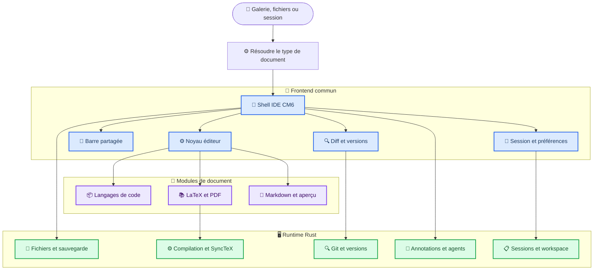
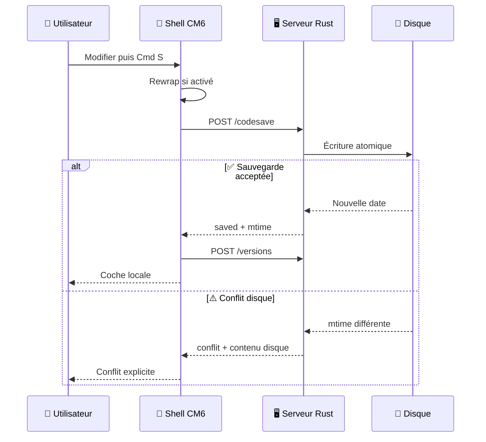
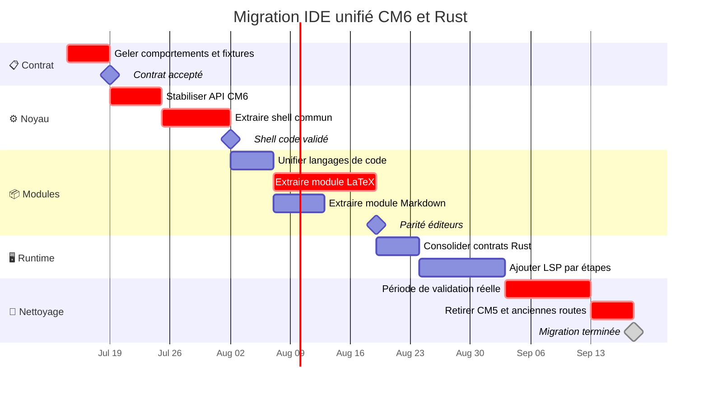

# Plan d’exécution - IDE Atelier unifié sur CM6 et runtime Rust

_Plan technique détaillé destiné à Grok pour unifier les éditeurs de `cmux-gallery` sans réintroduire Python ni dépendre du dépôt `atelier-studio`._

---

## 📋 Résumé exécutif

Atelier doit présenter **un seul IDE visible** pour Rust, Python, R, Julia, Shell, Markdown et LaTeX. Les différences entre les formats doivent devenir des modules spécialisés branchés sur un shell commun, et non des pages indépendantes qui recopient leur propre barre d’outils, leurs préférences et leur logique de sauvegarde.

Le moteur d’édition visible reste CodeMirror 6, livré comme bundle JavaScript local. Le serveur, les accès au système, la persistance, Git, les versions, la compilation LaTeX, SyncTeX, les annotations et l’orchestration des processus restent en Rust. Python peut être édité comme contenu, mais ne doit jamais être requis pour construire, tester, installer ou exécuter Atelier.

### Résultat attendu

À la fin du plan :

- ouvrir un fichier depuis la galerie, l’explorateur ou un onglet restauré produit le même shell IDE ;
- la barre, le thème, les états, les raccourcis, le wrap, le rewrap, la recherche, le diff et la sauvegarde sont identiques ;
- LaTeX ajoute PDF, compilation, SyncTeX, erreurs et plan du document ;
- Markdown ajoute un aperçu ;
- les langages de programmation ajoutent leur grammaire et, ensuite, leur LSP ;
- toutes les opérations privilégiées sont implémentées par `atelier-server` en Rust ;
- CM5 et les anciennes routes d’éditeur sont supprimés après une période de parité prouvée ;
- les assets installés et réellement servis sont vérifiés, pas seulement les sources.

> 📌 **Règle centrale :** ne pas réécrire CodeMirror en Rust/WASM. Unifier l’expérience dans CM6 et conserver Rust pour le runtime, la sécurité, les processus et les services système.

## 🎯 Objectifs, exclusions et invariants

### Objectifs obligatoires

1. Construire un shell d’éditeur CM6 partagé par toutes les surfaces éditables.
2. Supprimer les divergences entre ouverture depuis Galerie et ouverture depuis Fichiers.
3. Extraire la barre d’outils, les états, les préférences et les raccourcis des pages monolithiques.
4. Transformer LaTeX et Markdown en modules du shell commun.
5. Conserver les contrats HTTP Rust existants et compléter seulement les lacunes vérifiées.
6. Ajouter une matrice de tests comportementaux par langage et par route d’ouverture.
7. Supprimer CM5 et les pages obsolètes seulement après validation automatisée et visuelle.
8. Maintenir le verrou zéro-Python de production.

### Non-objectifs

- Réécrire CodeMirror, son DOM, sa sélection ou son accessibilité en Rust/WASM.
- Intégrer le code source de Zed, Lapce ou Helix dans une iframe.
- Ajouter Electron, un CDN ou une dépendance runtime vers `atelier-studio`.
- Changer le protocole d’annotations sans besoin démontré.
- Supprimer une surface avant que sa parité soit couverte par des tests.
- Mélanger cette migration avec une refonte graphique générale de la galerie.

### Invariants à ne jamais casser

| Invariant | Preuve exigée |
| --- | --- |
| Aucun runtime Python | `scripts/check-no-python.sh` passe |
| Racine projet confinée | tests Rust de chemins et symlinks passent |
| Sauvegarde atomique | tests `codesave` et conflit disque passent |
| Sélection vers agent | `/selinfo` et file d’annotations restent cohérents |
| Versions et restauration | `/versions`, diff et restore passent après reload |
| LaTeX sûr | compilation, logs, PDF et SyncTeX passent |
| Assets locaux | aucun CDN et hashes source/install identiques |
| Ouverture déterministe | même fichier = même éditeur, quelle que soit l’entrée |

## 🏗️ Architecture cible

### Vue logique



### Composants frontend proposés

Créer les fichiers suivants sous `assets/editor/` :

| Fichier | Responsabilité | Ne doit pas contenir |
| --- | --- | --- |
| `shell.js` | Composer layout, toolbar, panneaux et cycle de vie | logique propre à LaTeX |
| `core.js` | Créer CM6, reconfigurer langue et thème | requêtes serveur métier |
| `toolbar.js` | Wrap, rewrap, auto, état, commandes | sauvegarde HTTP directe |
| `commands.js` | Registre de commandes et raccourcis | manipulation DOM dispersée |
| `session.js` | Scroll, curseur, onglets, préférences | secrets ou chemins hors racine |
| `persistence.js` | Load, save, conflit, reload externe | UI spécialisée PDF |
| `selection.js` | Sélection, marques, `/selinfo`, annotations | code spécifique à un langage |
| `history.js` | Adaptateur vers `diff_versions.js` | logique Git du serveur |
| `languages.js` | Extension vers module CM6 | composants de layout |
| `status.js` | États localisés et feedback visuel | texte d’aide permanent |
| `modules/code.js` | Code, commentaires et rewrap sûr | PDF ou SyncTeX |
| `modules/latex.js` | Compilation, PDF, SyncTeX, outline | logique Rust/Python |
| `modules/markdown.js` | Aperçu Markdown et navigation | compilation TeX |

La forme exacte des noms peut changer, mais les responsabilités doivent rester séparées. Grok ne doit pas remplacer un monolithe par un autre monolithe.

### Composants Rust existants à conserver

| Crate | Responsabilité actuelle ou cible |
| --- | --- |
| `atelier-core` | chemins sûrs, écritures atomiques, génération galerie, SVG |
| `atelier-server` | HTTP, fichiers, documents, Git, workspace, Zotero, agents |
| `atelier-cli` | build, serve, doctor, status, stop, open |
| `atelier-mcp` | intégration Codex et contrôle d’Atelier |

### Contrats HTTP déjà présents

Le plan doit réutiliser les routes Rust actuelles :

- fichiers : `/ls`, `/snippet`, `/raw`, `/code`, `/codesave`, `/texroot`, `/findscript` ;
- sélection : `/selinfo`, `/quote`, `/agent-selection`, `/agent-selections` ;
- historique : `/versions`, `/githead`, `/gitlog`, `/gitshow`, `/gitcommit` ;
- documents : `/compile`, `/synctex`, `/lint`, `/export-png` ;
- workspace : `/state`, `/notes/*`, `/board/*` ;
- galerie : `/rescan`, `/regenerate`, `/thumb`, `/open`, `/delete`, `/export` ;
- santé : `/ping`, `/health`, `/rev`, `/provenance`.

Avant d’ajouter une route, Grok doit prouver qu’aucune route existante ne peut porter le contrat.

## 🔍 État initial et dette à éliminer

### Surfaces actuelles

| Surface | Rôle actuel | Problème principal | Destination |
| --- | --- | --- | --- |
| `assets/code_editor.html` | code générique CM6 | logique, UI et persistance dans une page | shell + module code |
| `assets/latex_studio.html` | LaTeX/PDF | très gros monolithe et barre différente | shell + module LaTeX |
| `assets/md_viewer.html` | Markdown source | logique CM6 dupliquée | shell + module Markdown |
| `assets/md_studio.html` | Markdown WYSIWYG | surface séparée utile mais incohérente | panneau/module optionnel |
| `assets/editor_factory.js` | choix CM6/CM5 | fallback CM5 temporaire | bootstrap CM6 uniquement |
| `cm6-src/facade.js` | façade compatible CM5 | utile pour migration, dette à réduire | API interne documentée |
| `assets/diff_versions.js` | diff, versions, Git | fort couplage au DOM des pages | adaptateur partagé |
| `assets/gallery_template.html` | routes d’ouverture et onglets | historique de routes divergentes | routeur unique |

### Symptômes à transformer en tests

- Le thème s’applique dans un aperçu mais pas dans l’éditeur.
- Un fichier `.rs` s’ouvre dans `latex_studio.html` depuis la galerie.
- Les contrôles Wrap/Rewrap/Auto varient selon la page.
- Un onglet restauré peut garder un ancien URL ou un ancien bundle.
- Les sources sont à jour mais `~/.local/share/atelier/assets` reste obsolète.
- Un test vérifie une option transmise mais pas l’éditeur réellement instancié.
- Un feedback de commande est éloigné du bouton et devient incompréhensible.

Chaque symptôme doit avoir au moins un test de non-régression avant la suppression de l’ancien chemin.

## ⚙️ Contrat fonctionnel du shell commun

### Barre d’outils

La barre doit contenir les mêmes primitives dans tous les documents :

1. nom du fichier ;
2. commande Open ;
3. sélection Wrap ;
4. commande Rewrap ;
5. toggle Auto-Rewrap ;
6. état de sauvegarde compact ;
7. accès aux versions ;
8. commandes spécialisées ajoutées par le module actif.

### États obligatoires

| État | Signal visuel | `aria-label` | Durée |
| --- | --- | --- | ---: |
| Propre | coche discrète | `saved` | persistant |
| Modifié | point ambre | `modified` | persistant |
| Sauvegarde | indicateur bref | `saving` | jusqu’à réponse |
| Conflit | `!` rouge | message de conflit | persistant |
| Rewrap réussi | coche locale sur bouton | nombre de blocs | 900 ms |
| Rien à faire | point ambre local | `rien à reformater` | 1 400 ms |
| Sélection invalide | rouge local | consigne précise | 1 800 ms |

Le feedback doit apparaître sur la commande déclenchée. Un message global peut compléter, mais ne doit pas être le seul signal.

### Wrap et rewrap

- `Wrap: window` replie visuellement selon la largeur disponible.
- `Wrap: off` autorise le scroll horizontal.
- `Wrap: N` fixe une largeur visuelle.
- `Rewrap` modifie réellement les retours de ligne.
- `Alt+Q` rewrap le bloc courant ou la sélection.
- `Shift+Alt+Q` rewrap tous les blocs compatibles.
- Auto-Rewrap intervient avant sauvegarde, uniquement si activé.

Règles de sécurité :

- code : ne rewrap que des blocs entièrement commentés ;
- Rust/JS/TS : préserver `//`, `///`, `/*` selon le module ;
- Python/R/Shell : préserver `#` ;
- LaTeX : ne jamais fusionner un bloc mixte contenant `%` non échappé ;
- Markdown : ne jamais considérer un titre `#` comme commentaire ;
- environnements TeX math, tableaux, verbatim et listes : ne pas rewrap automatiquement.

### Sauvegarde et modification externe



### Préférences

Toutes les préférences doivent utiliser des clés versionnées :

| Préférence | Clé proposée | Portée |
| --- | --- | --- |
| thème code | `atelier.editor.v1.codeTheme` | origine Atelier |
| wrap | `atelier.editor.v1.wrap` | origine Atelier |
| auto-rewrap | `atelier.editor.v1.autoRewrap` | origine Atelier |
| panneau actif | `atelier.editor.v1.panel` | document ou session |
| position/scroll | store serveur ou session versionnée | chemin projet |

Prévoir une migration unique depuis `atelierCodeTheme`, `cmWrap` et `codeAutoRewrap`. Ne pas maintenir deux sources de vérité après la migration.

## ✍️ Plan d’implémentation détaillé

### Phase 0 - Geler et mesurer le contrat actuel

**But :** transformer le comportement existant en contrat vérifiable avant les extractions.

Tâches :

- [x] Créer `tests/contracts/editor-surface-contract.test.mjs`.
- [x] Inventorier toutes les routes d’ouverture dans `gallery_template.html`.
- [x] Ajouter une matrice extension vers surface attendue.
- [x] Capturer les raccourcis et états des trois éditeurs.
- [x] Ajouter des fixtures `.rs`, `.py`, `.r`, `.jl`, `.sh`, `.tex`, `.md`, `.toml`, `.yaml`.
- [x] Tester ouverture depuis galerie, explorateur, session restaurée et URL directe.
- [x] Ajouter un test source/install avec hashes des assets.
- [x] Documenter les exceptions intentionnelles.

Critères de sortie :

- chaque chemin d’ouverture a un test ;
- les différences actuelles sont explicitement classées en dette ou comportement à conserver ;
- aucun changement visuel majeur n’est encore effectué.

### Phase 1 - Créer le noyau CM6 stable

**But :** faire de `cm6-src/` la seule source du moteur d’édition.

Tâches :

- [x] Définir une API interne non-CM5 dans `cm6-src/`.
- [x] Conserver temporairement la façade CM5 seulement aux frontières existantes.
- [x] Exposer création, destruction, langue, thème, wrap, sélection, scroll et diagnostics.
- [x] Ajouter des `Compartment` CM6 pour langue, thème, wrap, lecture seule et extensions module.
- [x] Ajouter `destroy()` et retirer tous les listeners globaux associés.
- [ ] Tester plusieurs éditeurs simultanés dans plusieurs iframes.
- [x] Rendre le build CM6 reproductible avec version et hash.
- [x] Interdire tout chargement CDN.

Critères de sortie :

- CM6 est instancié par défaut dans chaque fixture ;
- changer langue/thème/wrap ne recrée pas le document ;
- aucune fuite de listener après fermeture d’un onglet ;
- deux onglets du même fichier ne partagent pas accidentellement leur état volatile.

### Phase 2 - Extraire le shell commun

**But :** rendre la barre, les états et le layout indépendants du langage.

Tâches :

- [x] Créer `assets/editor/shell.js`.
- [x] Créer `assets/editor/toolbar.js`.
- [x] Créer `assets/editor/status.js`.
- [x] Déplacer Wrap/Rewrap/Auto hors de `code_editor.html`.
- [x] Déplacer sauvegarde, conflit et reload externe dans `persistence.js`.
- [x] Déplacer sélection et `/selinfo` dans `selection.js`.
- [x] Ajouter un registre `commands.js` pour boutons et raccourcis.
- [x] Rendre les commandes accessibles au clavier et avec `aria-label`.
- [x] Ajouter feedback local succès/rien/erreur sur Rewrap.
- [x] Tester à largeur normale et à 375 px sans débordement.

Critères de sortie :

- `code_editor.html` devient une page bootstrap mince ;
- aucune logique de toolbar n’est copiée dans une autre page ;
- chaque commande produit un état visible et testable ;
- la fermeture d’un onglet détruit correctement le shell.

### Phase 3 - Unifier les langages de code

**But :** faire passer tous les fichiers de code par le shell unique.

Tâches :

- [x] Centraliser extension vers langage dans `languages.js`.
- [x] Ajouter Rust, Python, R, Julia, Shell, JavaScript, TypeScript, JSON, TOML et YAML.
- [x] Utiliser texte brut sûr pour les extensions inconnues.
- [x] Définir les préfixes de commentaires par langage.
- [x] Tester syntax highlighting réel, pas seulement le nom du mode.
- [x] Tester thème partagé entre galerie et éditeur.
- [x] Modifier le routeur galerie pour pointer uniquement vers le shell code.
- [ ] Migrer les anciennes URLs restaurées vers la route canonique.
- [x] Empêcher `latex_studio.html` d’ouvrir `.rs`, `.py`, `.r`, `.jl` ou `.sh`.

Critères de sortie :

- toutes les extensions de code produisent `.cm-editor` ;
- au moins un token attendu est coloré pour chaque grammaire supportée ;
- la même préférence de thème est appliquée aux cartes et à l’éditeur ;
- les contrôles et états sont identiques pour toutes les langues.

### Phase 4 - Transformer LaTeX en module

**But :** conserver toute la puissance du studio LaTeX dans le shell commun.

Ordre d’extraction obligatoire :

1. chargement/sauvegarde ;
2. barre et états ;
3. compilation et logs ;
4. PDF ;
5. SyncTeX source vers PDF ;
6. SyncTeX PDF vers source ;
7. erreurs et gutters ;
8. outline ;
9. rewrap protégé ;
10. diff, versions et commentaires ;
11. ghost text/autocomplétion.

Tâches :

- [ ] Créer `assets/editor/modules/latex.js`.
- [ ] Monter le panneau PDF comme extension de layout, pas comme deuxième éditeur.
- [ ] Réutiliser `/compile`, `/synctex`, `/lint` et `/texroot`.
- [ ] Préserver les environnements interdits au rewrap.
- [ ] Réancrer commentaires et sélections après rewrap par contenu, pas seulement position.
- [ ] Conserver historique et restauration avant de supprimer du code source.
- [ ] Tester documents racines, `\input`, erreurs et PDF absent.
- [ ] Tester compilation lente sans bloquer la saisie.
- [ ] Comparer le contrat visuel avec le module code.

Critères de sortie :

- LaTeX utilise la même barre et les mêmes préférences ;
- PDF/SyncTeX fonctionnent dans les deux directions ;
- les commentaires survivent au rewrap et au reload ;
- aucune fonctionnalité LaTeX n’est perdue par rapport à la page initiale.

### Phase 5 - Transformer Markdown en module

**But :** unifier l’édition source et rendre l’aperçu optionnel.

Tâches :

- [ ] Créer `assets/editor/modules/markdown.js`.
- [ ] Utiliser le shell CM6 pour le mode source.
- [ ] Ajouter panneau d’aperçu activable et redimensionnable.
- [ ] Synchroniser scroll source/aperçu si le contrat actuel le permet.
- [ ] Conserver liens, images, formules et diagrammes supportés.
- [ ] Décider explicitement si Toast UI reste une commande WYSIWYG séparée.
- [ ] Ne pas forcer WYSIWYG comme moteur principal.
- [ ] Tester les modifications externes et conflits.

Critères de sortie :

- Markdown source utilise le shell commun ;
- l’aperçu n’introduit pas une deuxième source de vérité ;
- la route d’ouverture est identique depuis galerie et explorateur.

### Phase 6 - Consolider les services Rust

**But :** garantir que toute opération privilégiée reste en Rust.

Tâches :

- [ ] Auditer les appels réseau de tous les modules.
- [ ] Vérifier que chaque route pointe vers `atelier-server`.
- [ ] Ajouter les erreurs structurées manquantes avec code et message.
- [ ] Ajouter timeouts et annulation pour compilation, lint et LSP.
- [ ] Vérifier sécurité des chemins et symlinks pour chaque nouvelle entrée.
- [ ] Centraliser les écritures atomiques dans `atelier-core`.
- [ ] Tester redémarrage du serveur et récupération de session.
- [ ] Conserver `scripts/check-no-python.sh` dans la commande de test principale.

Critères de sortie :

- aucune commande frontend ne lance directement un processus système ;
- aucune invocation Python n’existe dans production, test ou fallback ;
- les erreurs serveur sont affichées sans faux succès UI.

### Phase 7 - Ajouter LSP et diagnostics

**But :** fournir l’intelligence IDE sans coupler le shell à un langage.

Tâches :

- [ ] Définir un gestionnaire LSP Rust dans `atelier-server`.
- [ ] Concevoir une session LSP par projet et langage, réutilisable entre onglets.
- [ ] Supporter démarrage, arrêt, santé, timeout et redémarrage.
- [ ] Ajouter transport websocket ou canal local documenté.
- [ ] Mapper diagnostics vers decorations CM6.
- [ ] Ajouter complétion, hover, définition, références et rename progressivement.
- [ ] Commencer par `rust-analyzer` et `texlab`.
- [ ] Ajouter Python, R, Julia et Markdown seulement après stabilisation du contrat.
- [ ] Afficher clairement `LSP indisponible` sans bloquer l’édition.

Critères de sortie :

- l’édition fonctionne sans LSP ;
- un crash LSP ne ferme pas Atelier ;
- les diagnostics sont associés à la bonne version du document ;
- les processus sont arrêtés lorsque le projet n’est plus utilisé.

### Phase 8 - Retirer CM5 et les anciennes pages

**But :** supprimer la compatibilité devenue inutile.

Prérequis stricts :

- deux semaines d’utilisation réelle ou une période explicitement approuvée ;
- tests code, LaTeX, Markdown, diff, annotations et sauvegarde verts ;
- approbation humaine explicite ;
- rollback identifié.

Tâches :

- [ ] Retirer `?editor=cm5`.
- [ ] Supprimer `assets/cm/` et les chargeurs CM5.
- [ ] Retirer les branches CM5 de `editor_factory.js`.
- [ ] Réduire puis supprimer la façade de compatibilité inutile.
- [ ] Transformer `latex_studio.html`, `md_viewer.html` et `code_editor.html` en redirections/bootstrap ou les supprimer.
- [ ] Migrer les URLs sauvegardées avant retrait.
- [ ] Ajouter un verrou CI contre `codemirror.min.js` et APIs CM5 interdites.
- [ ] Nettoyer documentation et installateurs.

Critères de sortie :

- une seule implémentation CM6 est distribuée ;
- aucune ancienne route ne sert un éditeur différent ;
- aucun asset CM5 n’est installé ;
- rollback possible vers le dernier tag avant suppression.

## 🧪 Stratégie de test obligatoire

### Niveaux de validation

| Niveau | Outil | Responsabilité |
| --- | --- | --- |
| Rust unitaire | `cargo test` | chemins, écritures, erreurs, modules serveur |
| Rust HTTP | `http_smoke.rs` | routes et contrats JSON |
| Contrats Node | `node --test` | routes, templates, bundles, mapping extensions |
| Playwright | tests E2E | comportements visibles et interactions |
| Navigateur Atelier | Browser in-app | preuve de l’asset réellement servi |
| Vérification zéro-Python | script shell | absence d’invocation et fallback Python |

### Matrice minimale E2E

Chaque case doit tester Galerie, Fichiers et URL directe lorsque pertinent.

| Fonction | Code | LaTeX | Markdown |
| --- | :---: | :---: | :---: |
| Chargement exact | Oui | Oui | Oui |
| Thème partagé | Oui | Oui | Oui |
| Wrap window/off/fixe | Oui | Oui | Oui |
| Rewrap sûr | commentaires | paragraphes | défini explicitement |
| Auto-rewrap | Oui | Oui | si activé |
| Sauvegarde | Oui | Oui | Oui |
| Conflit externe | Oui | Oui | Oui |
| Versions/restore | Oui | Oui | Oui |
| Sélection agent | Oui | Oui | Oui |
| Recherche/remplacement | Oui | Oui | Oui |
| Panneau spécialisé | non | PDF | aperçu |
| Reload/session | Oui | Oui | Oui |

### Assertions comportementales

Les tests doivent vérifier :

- présence de `.cm-editor` et absence de moteur CM5 ;
- texte chargé exactement égal au fichier ;
- classe/token syntaxique réel après parsing ;
- style calculé du thème ;
- état du bouton après action ;
- contenu disque après sauvegarde ;
- restauration du scroll et du curseur ;
- contenu et ancrage des commentaires après rewrap ;
- URL canonique de l’iframe active ;
- absence d’erreurs console pertinentes ;
- absence d’overlay framework ;
- rendu sans overflow au viewport étroit.

Un test qui vérifie seulement `mode: "rust"`, `engine: "cm6"` ou une chaîne dans le HTML n’est pas une preuve suffisante.

### Commande de validation cible

```bash
scripts/check-no-python.sh
cargo test --manifest-path rust/Cargo.toml --locked
node --test tests/contracts/*.test.mjs
npx playwright test
git diff --check
```

## 📦 Build, installation et assets servis

### Pipeline cible

1. compiler le bundle CM6 depuis `cm6-src/` ;
2. exécuter les contrats Node ;
3. compiler les crates Rust ;
4. copier les assets dans `dist/` ;
5. installer binaires et assets ;
6. comparer hashes source, dist et installation ;
7. lancer un serveur de smoke ;
8. ouvrir et vérifier l’IDE servi.

### Sources de vérité

| Artefact | Source de vérité | Copie générée |
| --- | --- | --- |
| CM6 | `cm6-src/` | `assets/cm6/` |
| UI éditeur | `assets/editor/` | `dist/assets/editor/` |
| templates | `assets/*.html` | assets installés |
| serveur | `rust/crates/atelier-server` | binaire installé |
| CLI | `rust/crates/atelier-cli` | binaire `atelier` |
| MCP | `rust/crates/atelier-mcp` | plugin installé |

Ne jamais modifier une copie générée sans modifier sa source. Ne jamais conclure qu’une correction est visible avant d’avoir vérifié l’asset servi.

## 🔄 Migration sans interruption

### Compatibilité temporaire

- garder les URLs historiques pendant la migration ;
- les faire rediriger vers le shell canonique ;
- conserver les paramètres `path`, `file`, `v`, thème et token nécessaires ;
- journaliser les routes historiques encore utilisées ;
- retirer une route seulement lorsque son compteur d’usage devient nul pendant la période définie.

### Stratégie de flags

| Flag | Usage | Retrait |
| --- | --- | --- |
| `?editorShell=v2` | activer le shell durant développement | quand v2 devient défaut |
| `?editor=cm5` | diagnostic temporaire | phase 8 |
| `ATELIER_EDITOR_V2` | test CLI/serveur si nécessaire | dès stabilisation |

Limiter les flags. Aucun flag ne doit devenir une architecture permanente.

### Rollback

- taguer le dernier état avant activation par défaut ;
- conserver une commande documentée pour désactiver v2 pendant la phase de test ;
- ne pas migrer irréversiblement les données de versions ;
- versionner les préférences et supporter un reset ;
- restaurer assets et binaires comme une unité atomique.

## ⚠️ Risques et mesures de contrôle

| Risque | Impact | Mesure |
| --- | --- | --- |
| Régression LaTeX cachée | perte de workflow scientifique | extraction fonction par fonction |
| Façade CM5 éternelle | dette et ambiguïté | budget de suppression phase 8 |
| Assets installés obsolètes | correction invisible | hashes et smoke installé |
| Rewrap destructeur | code ou document corrompu | règles par langage + undo + tests |
| Conflit disque silencieux | perte de données | mtime + UI explicite + version |
| LSP bloque l’éditeur | saisie inutilisable | processus isolé, timeout, fallback |
| Deux onglets concurrents | écrasement | version document et conflit contrôlé |
| Route galerie divergente | thème/fonction différente | routeur canonique testé |
| Trop gros refactor | diagnostic impossible | commits par phase et gates stricts |

## 📈 Calendrier indicatif

Ce calendrier est une estimation pour ordonner les dépendances, pas une promesse de date. Une phase ne commence que lorsque le gate précédent est vert.



## ✅ Gates de décision

### Gate A - avant extraction

- [ ] matrice d’ouverture couverte ;
- [ ] fixtures disponibles ;
- [ ] tests zéro-Python verts ;
- [ ] sauvegarde de référence vérifiée.

### Gate B - avant activation du shell par défaut

- [ ] code Rust et Python testés en navigateur ;
- [ ] thème, wrap, rewrap, save et diff testés ;
- [ ] galerie et explorateur ouvrent le même URL canonique ;
- [ ] assets installés vérifiés par hash.

### Gate C - avant migration LaTeX

- [x] compilation et SyncTeX ont des fixtures ;
- [x] erreurs, PDF et outline ont des assertions ;
- [x] commentaires ancrés ont un test rewrap/reload.
- [x] SyncTeX deux directions couvertes (view + edit) ;
- [x] extraction progressive des helpers sans suppression du monolithe studio.

### Gate D - avant retrait CM5

- [ ] suite complète verte ;
- [ ] période de validation réelle terminée ;
- [ ] aucune route historique active ;
- [ ] approbation humaine explicite ;
- [ ] rollback testé.

## 🤖 Contrat d’exécution pour Grok

Grok doit suivre ces règles pendant l’implémentation :

1. Lire `AGENTS.md` et les documents de migration Rust existants avant toute modification.
2. Inspecter le worktree et préserver les changements non liés.
3. Ne pas supprimer ou écraser une modification utilisateur pour simplifier un patch.
4. Travailler une phase à la fois.
5. Commencer chaque phase par un test qui échoue sur le contrat visé.
6. Faire le plus petit patch qui rend ce test vert.
7. Vérifier le navigateur réellement servi après toute modification visible.
8. Synchroniser source, dist et installation avant de conclure.
9. Ne pas ajouter de Python, de CDN ou de dépendance runtime à `atelier-studio`.
10. Ne pas copier aveuglément les pages d’Atelier Studio ; extraire les contrats utiles.
11. Ne pas déclarer la parité sur la seule base d’un build réussi.
12. Ne pas passer à la phase suivante si le gate courant est rouge.

### Format de compte rendu par phase

Grok doit produire :

```text
Phase :
Objectif :
Fichiers modifiés :
Contrats ajoutés :
Tests exécutés :
Résultats :
Validation navigateur :
Risques restants :
Gate : PASS ou BLOCKED
Prochaine étape autorisée :
```

### Première tâche à confier à Grok

```text
Implémente uniquement la phase 0 du document
docs/plan-ide-unifie-cm6-runtime-rust.md.

Contraintes :
- aucun changement de comportement produit sauf instrumentation de test ;
- aucun nouveau runtime Python ;
- préserve le worktree existant ;
- ajoute la matrice extension -> surface ;
- couvre Galerie, Fichiers, URL directe et session restaurée ;
- vérifie la copie installée réellement servie ;
- arrête-toi au Gate A et rends le compte rendu demandé.
```

## 📚 Définition finale de terminé

Le projet est terminé uniquement si toutes les affirmations suivantes sont vraies :

- [ ] un seul shell CM6 compose toutes les surfaces source ;
- [ ] toutes les ouvertures convergent vers une route canonique ;
- [ ] la barre d’outils et les feedbacks sont communs ;
- [ ] code, LaTeX et Markdown utilisent des modules, pas des forks du shell ;
- [ ] LaTeX conserve compilation, PDF, SyncTeX, logs, outline et diff ;
- [ ] Markdown conserve un aperçu optionnel ;
- [ ] thèmes et préférences ont une seule source de vérité ;
- [ ] versions, annotations et commentaires survivent à rewrap/reload ;
- [ ] serveur, CLI, MCP et opérations système sont Rust ;
- [ ] aucun Python n’est requis pour build, test, installation ou runtime ;
- [ ] CM5 et ses assets sont supprimés ;
- [ ] les tests automatisés et la validation navigateur sont verts ;
- [ ] les assets installés sont identiques aux sources construites ;
- [ ] la suppression des anciens chemins a reçu une approbation humaine.

---

_Dernière mise à jour : 2026-07-11 · Document d’exécution pour la migration de l’IDE Atelier_
