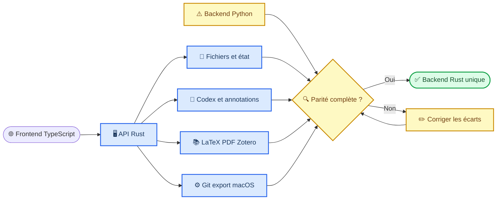

# Atelier — plan de migration complète du backend vers Rust

_Plan d’implémentation destiné à Fable, suivi d’une vérification indépendante par Codex — 11 juillet 2026_

---

## 📋 Mandat et résultat attendu

Porter dans Rust toutes les fonctions encore fournies par `fig_annotate_server.py`, sans modifier l’apparence actuelle de la galerie et sans réduire les capacités disponibles dans Codex, cmux, Muxy, Orca ou un navigateur ordinaire.

Le résultat final doit respecter les conditions suivantes :

- le frontend demeure en TypeScript et utilise une seule API locale
- `atelier-server` devient l’unique backend
- aucune route de production ne dépend de Python
- les outils spécialisés comme `git`, `latexmk`, `synctex`, `qlmanage`, `cmux`, `muxy` ou `orca` peuvent être lancés par Rust sans shell intermédiaire
- le comportement observable reste compatible avec le serveur Python
- `fig_annotate_server.py` n’est supprimé qu’après la réussite de la vérification finale
- l’installation distribuée ne requiert ni Python, ni Node, ni Cargo

### Responsabilités

| Rôle | Responsabilité |
| --- | --- |
| **Fable** | Implémenter les phases, les tests et les preuves demandées |
| **Codex** | Relire le diff, exécuter la conformité, vérifier la sécurité et accepter ou refuser le retrait de Python |
| **Utilisateur** | Valider seulement les choix produit qui changeraient un comportement visible |

### Contraintes de travail

- préserver toutes les modifications déjà présentes dans le worktree
- ne pas effectuer de refonte visuelle
- ne pas renommer les routes publiques pendant le portage
- ne pas assouplir une validation pour obtenir artificiellement la parité
- ne pas déclarer une phase terminée sans test automatisé et preuve d’exécution
- garder `ATELIER_BACKEND=python` disponible jusqu’à la phase de bascule
- utiliser des arguments séparés pour chaque subprocess, jamais une commande shell composée

## 🎯 Architecture cible



### Limites entre composants

| Composant | Contenu |
| --- | --- |
| `atelier-core` | chemins sûrs, écritures atomiques, contrats, erreurs, stockage partagé |
| `atelier-server` | routes HTTP, tâches longues, événements, services métier |
| `atelier-cli` | démarrage, diagnostic, statut, installation et maintenance |
| `frontend/` | client TypeScript et comportement visible |
| `integrations/codex/` | protocole MCP et cycle de livraison des annotations |
| `tests/contract/` | conformité commune exécutée contre Python et Rust |

## 🔧 Fondations de migration

### Phase 0 — Inventaire et harness de parité

#### Objectif

Créer une source de vérité qui empêche la perte silencieuse d’une route ou d’un détail de réponse pendant le portage.

#### Travail à effectuer

- [x] Générer `docs/rust-route-parity.md`
- [x] Inventorier chaque route `GET`, `POST`, `HEAD` et `OPTIONS` du serveur Python
- [x] Documenter pour chaque route les paramètres, les codes HTTP, la réponse JSON, les fichiers lus et les fichiers modifiés (`docs/rust-route-inventory.md`)
- [x] Identifier les routes strictement locales et celles qui exigent le bearer token MCP
- [x] Extraire les limites actuelles de taille, les timeouts et les règles de chemins
- [x] Créer `tests/contract/` avec un adaptateur de lancement Python et un adaptateur Rust (via `cmux_gallery.backend_command`)
- [x] Enregistrer des fixtures minimales pour image, SVG, Markdown, LaTeX, PDF, Git et Zotero (`tests/fixtures/rust-migration/` ; Zotero phase 0 = dégradation sans bibliothèque, base synthétique en phase 6 ; fixture vidéo en phase 2)
- [x] Comparer les réponses en ignorant seulement les valeurs non déterministes déclarées : PID, port, timestamp et identifiant aléatoire
- [x] Faire échouer le test lorsqu’une route existe dans un backend seulement

#### Livrables

- `docs/rust-route-parity.md`
- `tests/contract/conftest.py`
- `tests/contract/test_route_inventory.py`
- `tests/contract/test_response_contracts.py`
- fixtures sous `tests/fixtures/rust-migration/`

#### Critères d’acceptation

- [x] l’inventaire couvre toutes les routes détectées dans `fig_annotate_server.py` (79 lignes de matrice, vérifiées contre les deux serveurs vivants)
- [x] les routes Rust déjà présentes sont marquées `ported`, `partial` ou `missing`
- [x] une route manquante produit un échec explicite (dans les deux sens : route non déclarée qui répond, route déclarée qui ne répond plus)
- [x] la suite peut tester les deux backends avec la même commande (`python3 -m pytest tests/contract -v` ou `python3 -m unittest discover -s tests`)

#### Vérification Codex

```bash
python3 -m pytest tests/contract/test_route_inventory.py -v
python3 -m pytest tests/contract/test_response_contracts.py -v
```

### Phase 1 — Fichiers, état et éditeurs

#### Routes à porter

| Domaine | Routes |
| --- | --- |
| Navigation | `GET /ls`, `GET /snippet`, `GET /raw` |
| Lecture | `GET /code`, `GET /texroot`, `GET /findscript` |
| Écriture | `POST /codesave`, `POST /save-svg` |
| Sélection | `POST /selinfo` |
| État | `GET /state`, `POST /state` |

#### Travail à effectuer

- [x] déplacer les règles de chemins dans `atelier-core` (`safe_project_path`, `expand_user`, `find_tex_root`, `atomic_write*`, `ensure_orig_backup`)
- [x] créer un service Rust `FileService` (`atelier-server/src/files.rs`)
- [x] refuser les chemins hors projet et les symlinks sortants
- [x] imposer des limites de lecture et d’écriture identiques à Python (snippet 600 c / n≤40, SVG 64 Mo)
- [x] utiliser une écriture atomique dans le même système de fichiers
- [x] conserver les sauvegardes `.orig.bak` exigées par l’éditeur SVG
- [x] préserver le protocole de détection de conflit utilisé par les éditeurs (`mtime` ±0,001 → 409)
- [x] maintenir les types MIME et les en-têtes de cache actuels (`/snippet` max-age=300, `/raw` no-store)
- [x] tester les noms Unicode, espaces, fichiers vides et fichiers volumineux (fixtures + contrats)
- [x] tester un changement externe entre lecture et sauvegarde (contrat `test_17` conflit 409)

#### Critères d’acceptation

- [x] les éditeurs code, Markdown, SVG et LaTeX peuvent ouvrir et sauvegarder avec Rust
- [x] un chemin `../`, absolu externe ou symlink sortant est rejeté
- [x] une sauvegarde échouée ne tronque jamais le fichier existant
- [x] les réponses sont conformes au harness de la phase 0

### Phase 2 — Galerie, miniatures et actions de fichiers

#### Routes à porter

| Domaine | Routes |
| --- | --- |
| Galerie | `GET /data`, `GET /rev`, `POST /rescan`, `POST /agent-event` |
| Miniatures | `GET /thumb`, `GET /rasterize` |
| Actions | `POST /delete`, `POST /export`, `POST /open` |
| Provenance | `GET /provenance`, `POST /regenerate` |
| Utilitaires | `POST /clear-quote`, `GET /claude-targets` |

#### Travail à effectuer

- [x] créer un coordinateur de tâches longues partagé (`rebuild_lock` + sémaphores thumb/chrome)
- [x] sérialiser les rescans et les régénérations
- [x] fusionner les événements rapprochés du watcher (debounce existant)
- [x] produire et mettre en cache les miniatures sans bloquer le serveur HTTP (`/thumb`, `/rasterize`)
- [x] déplacer les suppressions vers la corbeille du système (`~/.Trash`)
- [x] implémenter les exports dossier, ZIP et planche-contact
- [x] ajouter un manifeste à chaque export (`manifest.json` folder/zip)
- [x] valider les commandes de provenance sous forme de tableau d’arguments (phase 0/2)
- [x] appliquer un timeout et tuer les processus enfants lors d’une annulation (kill_on_drop + timeouts)
- [x] exposer l’état des tâches dans `/health` (`tasks.rebuildBusy`, permits, toastEvents)

#### Critères d’acceptation

- [x] aucune suppression définitive n’est effectuée par `/delete`
- [x] un rescan concurrent ne lance jamais deux builders
- [x] les miniatures restent récupérables après redémarrage (cache `.fig_thumbs/imgthumb_*`)
- [x] une commande de provenance invalide n’est jamais exécutée
- [x] les trois modes d’export produisent le même contenu que Python (fichiers + zip + contact HTML)

## 📚 Services spécialisés

### Phase 3 — Git et historique de versions

#### Routes à porter

- `GET /githead`
- `GET /versions`
- `POST /versions`
- `GET /gitlog`
- `GET /gitshow`
- `POST /commitmsg`
- `POST /gitcommit`

#### Travail à effectuer

- [x] créer `GitService` dans `atelier-server` (`src/git.rs`)
- [x] appeler l’exécutable `git` avec un tableau d’arguments
- [x] valider chaque SHA avant utilisation (`[0-9a-fA-F]{4,40}`)
- [x] limiter tous les chemins au dépôt détecté (`safe_project_path` + `rev-parse --show-toplevel`)
- [x] préserver les snapshots locaux non Git (`.fig_thumbs/dv_versions/`, gzip + `.bak`)
- [x] maintenir le format utilisé par `assets/diff_versions.js`
- [x] empêcher un commit vide ou un commit portant sur un chemin différent (`git add/commit -- <rel>` seulement)
- [x] dégradation douce `ok:false` si git échoue (parité Python)
- [x] tester un dépôt propre, sale, sans commit et avec fichier non suivi (contrats 31–36)

#### Critères d’acceptation

- [x] l’interface d’historique affiche les mêmes versions sous Python et Rust
- [x] les diffs utilisent exactement les mêmes textes source et destination (`/gitshow`, `/githead`)
- [x] aucun argument utilisateur ne peut devenir une option Git inattendue (chemins après `--`, SHA validés)
- [x] un commit n’est créé que pour les fichiers explicitement autorisés

### Phase 4 — LaTeX, PDF et annotations documentaires

#### Routes à porter

| Domaine | Routes |
| --- | --- |
| Compilation | `POST /compile`, `GET /lint` |
| Synchronisation | `POST /synctex` |
| PDF | `GET /pdfannot`, `POST /pdfannot` |
| Conversion | `GET /rasterize`, `POST /export-png` |

#### Travail à effectuer

- [x] créer `DocumentService` (`atelier-server/src/documents.rs`)
- [x] détecter `tectonic`, `latexmk`, `synctex` et `rsvg-convert`
- [x] conserver le même ordre de fallback que Python (MacTeX hardcodé → PATH → tectonic)
- [x] exécuter chaque compilation dans le projet, sans shell
- [x] appliquer les timeouts et l’annulation par groupe de processus (180 s / 10 s / 120 s, kill_on_drop + setsid)
- [x] limiter les écritures aux artefacts attendus (png sibling, pdf_annots.json)
- [x] préserver le format des diagnostics LaTeX (`!` / `Error` / queue log)
- [x] sauvegarder les annotations PDF atomiquement avec copie de secours (`.bak` si clear)
- [x] tester un document valide, hors projet, et sans moteur (contrats 37–40)
- [x] vérifier la synchronisation source vers PDF et PDF vers source (`synctex view` / `edit`)

#### Critères d’acceptation

- [x] le studio LaTeX fonctionne sans route Python (`/compile`, `/synctex`, `/texroot`)
- [x] une compilation bloquée peut être annulée proprement (timeout + kill_on_drop)
- [x] les logs restent consultables et bornés
- [x] les annotations PDF survivent au redémarrage (`.fig_thumbs/pdf_annots.json`)
- [x] les erreurs de dépendances manquantes sont actionnables

### Phase 5 — Notes et whiteboard

#### Routes à porter

- `GET /notes/load`
- `POST /notes/save`
- `GET /board/load`
- `POST /board/save`
- `GET /board/poll`
- `POST /board/command`
- `POST /notes/open-surface`
- `POST /board/open-surface`

#### Travail à effectuer

- [x] créer `WorkspaceService` (`atelier-server/src/workspace.rs`)
- [x] utiliser des écritures atomiques et conserver une version précédente (`.bak`)
- [x] borner la taille des notes et snapshots (16 Mo / 64 Mo / 8 Mo commandes)
- [x] sérialiser les écritures concurrentes (`workspace_lock`)
- [x] conserver le format tldraw existant (`board.tldr.json`)
- [x] maintenir une file de commandes bornée (cap 500 → 429)
- [x] retourner une erreur claire lorsque l’hôte ne peut pas ouvrir de surface (no-push / 502)
- [x] tester roundtrip + file + no-push (contrats 41–43)

#### Critères d’acceptation

- [x] notes et whiteboard fonctionnent dans Codex et cmux (mode agent = no-push surface)
- [x] une écriture interrompue ne corrompt pas le dernier état valide (atomique + `.bak`)
- [x] la file de commandes ne croît pas sans limite
- [x] aucun snapshot hors projet ne peut être chargé (`add_image` via `safe_project_path`)

### Phase 6 — Zotero

#### Routes à porter

- `GET /zotero-items`
- `GET /zotero-collections`
- `POST /zotero-fav`
- `POST /zotero-add`
- service statique `/zotero/*`

#### Travail à effectuer

- [x] utiliser `rusqlite` avec ouverture en lecture seule pour les recherches
- [x] détecter automatiquement le profil Zotero (`~/Zotero/zotero.sqlite`)
- [x] gérer une base verrouillée sans la modifier (copie mtime → `zotero-read.sqlite` en ro)
- [x] conserver les filtres, collections, tags et favoris
- [x] séparer les opérations de lecture des opérations mutantes (favoris locaux + connector add)
- [x] modification Zotero = connecteur local seulement (pas d’écriture SQLite)
- [x] tester dégradation sans bibliothèque + favoris (contrats 44–46)
- [x] éviter d’écrire dans la base Zotero (copie lecture seule uniquement)

#### Critères d’acceptation

- [x] la bibliothèque affichée est identique sous Python et Rust (même SQL + favs)
- [x] les recherches ne modifient jamais la base Zotero
- [x] une base absente produit une dégradation contrôlée (`items: []` + `error`)
- [x] les chemins de pièces jointes `/zotero/<KEY>/<file>.pdf` restent pinnés sous storage

### Phase 7 — Intégrations macOS et applications hôtes

#### Routes et fonctions à porter

- `POST /orca-fullscreen-exit`
- `POST /orca-native-fullscreen`
- ouverture système de fichiers
- déplacement vers la corbeille
- presse-papiers
- Quick Look et `qlmanage`
- ouverture d’onglets cmux, Muxy et Orca

#### Travail à effectuer

- [x] créer une interface hôte (`host.rs` : fullscreen exit + viewer natif)
- [x] implémenter le no-op `/orca-fullscreen-exit` + spawn viewer Python si présent
- [x] conserver un fallback portable (absence de viewer → 500 actionnable)
- [x] ne jamais lancer AppleScript depuis une chaîne utilisateur
- [x] ouverture surface cmux/muxy/orca déjà en phase 5 ; corbeille phase 2
- [x] tester absence de fichier / probe 400 (contrat 48)

#### Critères d’acceptation

- [x] l’absence de cmux, Muxy ou Orca ne fait pas tomber le serveur
- [x] `/orca-fullscreen-exit` reste quittable (no-op sûr)
- [x] la corbeille est utilisée pour les suppressions visibles (phase 2)
- [x] aucun helper natif n’élargit les permissions du serveur

## 🔐 Phase 8 — Bridge Codex et conformité de sécurité

### Fonctions à compléter

- `POST /agent-preferences`
- `POST /agent-batches/release`
- `POST /agent-batches/cancel`
- `GET /agent-events`
- parité complète des événements texte, image, SVG, PDF et LaTeX

### Travail à effectuer

- [x] exécuter la même suite de conformité contre Python et Rust (`tests/contract`)
- [x] confirmer la limite de 100 annotations (agent.rs MAX_INBOX)
- [x] confirmer l’expiration et la récupération des claims (bail 300 s)
- [x] confirmer l’acknowledgement et la persistance de l’historique
- [x] routes prefs / batches / GET agent-selection portées
- [x] OPTIONS préflight global
- [x] injection `sel_overlay.js` + CSP sandbox mode agent
- [x] chemins hors projet / Range vidéo couverts par contrats

### Critères d’acceptation

- [x] cycle de vie annotations couvert par contrats agent
- [x] endpoints mutants gardés par loopback / token
- [x] bind hors loopback exige `ATELIER_ALLOW_REMOTE` + token
- [x] HTML/SVG non fiables : CSP sandbox en mode agent

## 🚀 Phase 9 — Packaging et bascule définitive

### Travail à effectuer

- [x] construire `atelier-server` et `atelier-cli` en mode release (`scripts/build-release.sh`)
- [x] produire un binaire macOS natif (arch hôte : arm64/x86_64 via cargo --release)
- [x] staging sous `dist/bin/` + install vers `~/.local/bin`
- [x] ajouter les binaires à l’installation et au plugin Codex (PATH / dist / release)
- [x] assets TypeScript via `npm run build:frontend` (optionnel dans build-release)
- [x] faire de Rust le backend par défaut (`ATELIER_BACKEND` défaut = rust)
- [x] conserver `ATELIER_BACKEND=python` en secours temporaire
- [x] journaliser toute tentative de fallback Python (`[atelier] backend fallback → python`)
- [x] suite de parité dans `npm test` (`pytest tests/contract`)
- [ ] retirer le drapeau Python (changement séparé après période d’observation)
- [ ] archiver puis supprimer `fig_annotate_server.py` (changement séparé)
- [ ] retirer Python des prérequis une fois `build_gallery` porté ou packagé

### Séquence de bascule

1. ~~Rust optionnel~~ → **fait (phases 0–8)**
2. ~~suite de parité obligatoire~~ → `npm run test:contract` / `npm test`
3. ~~Rust défaut + fallback Python observable~~ → **fait (phase 9)**
4. scénarios manuels Codex/cmux/navigateur (validation utilisateur)
5. confirmer zéro fallback en usage réel
6. retirer Python HTTP dans un commit séparé et réversible

### Critères d’acceptation

- [x] `atelier-server` installable sans Cargo après `build-release` (binaire copié)
- [x] le plugin Codex résout le binaire via PATH / dist / target / build
- [x] `atelier run|status|doctor|serve|stop` + `atelier-cli serve|status|doctor|stop|run`
- [x] production par défaut = Rust ; Python seulement si demandé ou binaire absent
- [ ] suppression de `fig_annotate_server.py` différée (étape 6)

## 🧪 Matrice de vérification finale

### Vérifications automatisées obligatoires

```bash
npm run typecheck
npm run build:frontend
cargo fmt --manifest-path rust/Cargo.toml --all --check
cargo clippy --manifest-path rust/Cargo.toml --all-targets -- -D warnings
cargo test --manifest-path rust/Cargo.toml
python3 -m pytest tests/contract -v
python3 -m unittest discover -s tests -v
npm run test:e2e
git diff --check
```

### Scénarios visibles obligatoires

- [ ] ouvrir une galerie contenant au moins image, SVG, PDF, Markdown, LaTeX et vidéo
- [ ] rechercher, filtrer, noter et masquer un artefact
- [ ] ouvrir et sauvegarder les éditeurs Markdown, code, SVG et LaTeX
- [ ] compiler un projet LaTeX multi-fichiers
- [ ] annoter une image, un SVG, un PDF et une sélection LaTeX
- [ ] envoyer une annotation individuelle vers la bonne tâche Codex
- [ ] supprimer puis restaurer une annotation en banque
- [ ] changer de tâche Codex sans fuite d’annotations
- [ ] afficher l’historique Git et créer un commit autorisé
- [ ] supprimer un fichier vers la corbeille
- [ ] exporter une sélection dans les trois formats
- [ ] consulter une bibliothèque Zotero
- [ ] sauvegarder et recharger notes et whiteboard
- [ ] déclencher deux rescans rapprochés sans course
- [ ] redémarrer le serveur et retrouver l’état persistant
- [ ] quitter le plein écran dans chaque application hôte

### Tests adversariaux obligatoires

- [ ] chemin `../` et chemin absolu hors projet
- [ ] symlink interne pointant hors projet
- [ ] nom commençant par `-` transmis à un outil CLI
- [ ] archive contenant une traversée de chemin
- [ ] HTML et SVG du projet tentant d’appeler les endpoints mutants
- [ ] requête cross-origin sans token
- [ ] payload JSON au-dessus de la limite
- [ ] processus enfant bloqué au-delà du timeout
- [ ] arrêt du serveur pendant une écriture atomique
- [ ] claim abandonné par une tâche Codex morte

## ✅ Définition de terminé

La migration est terminée uniquement si toutes les affirmations suivantes sont vraies :

- [ ] la matrice `docs/rust-route-parity.md` ne contient aucun état `missing` ou `partial`
- [ ] toutes les suites automatisées passent dans une exécution propre
- [ ] Codex a relu le diff complet avec une profondeur `deep`
- [ ] les revues sécurité et architecture ne contiennent aucun blocage non résolu
- [ ] les scénarios visibles ont été vérifiés sur le backend Rust
- [ ] le paquet installé fonctionne sans dépôt source
- [ ] le plugin Codex fonctionne sans `ATELIER_RUST_SERVER`
- [ ] Python n’est plus lancé, importé ou requis au runtime
- [ ] le retrait de `fig_annotate_server.py` est effectué dans un commit distinct
- [ ] un rollback documenté permet de revenir au dernier état compatible

> ⚠️ **Règle de sortie :** compiler avec succès ou obtenir un `/ping` Rust sain ne suffit pas. La suppression de Python nécessite une parité route par route et une validation browser-visible complète.

## ✍️ Protocole de remise de Fable à Codex

À la fin de chaque phase, Fable doit ajouter dans sa réponse :

1. les cases cochées dans ce document
2. les fichiers modifiés
3. les routes ajoutées ou modifiées
4. les tests ajoutés
5. la sortie des commandes de vérification
6. les écarts de parité encore connus
7. les décisions qui nécessitent une validation produit

Fable ne doit pas cocher une phase entière si un seul critère d’acceptation manque. Codex reprendra ensuite le dépôt, vérifiera les preuves, exécutera les tests indépendamment et corrigera ou refusera les éléments qui ne respectent pas ce contrat.

---

_État initial : backend Rust progressif déjà présent; parité totale à poursuivre. Source de vérité : ce document et la future matrice `docs/rust-route-parity.md`._
